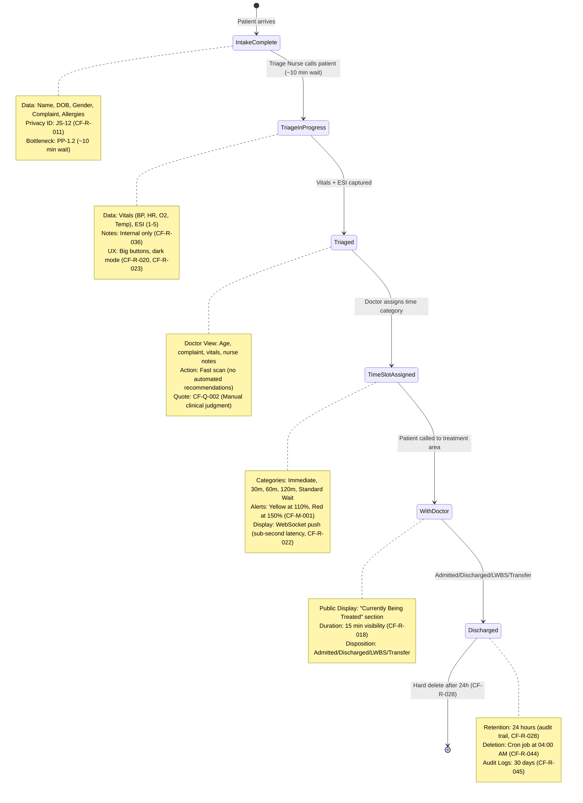

# Workflow Observations: Ragus Emergency Room Triage System

## Executive Summary

This document synthesizes workflow insights from 5 discovery interview sessions (Session 1.1, 1.2, 1.3, 2.1 Cross-Check, 2.1 Security), mapping the complete patient journey from arrival through disposition. The Ragus system operates as an ephemeral flow tool supporting a 5-state workflow with strict privacy compliance, on-premise deployment, and zero-training UX requirements.

**Key Workflow Characteristics**:
- **5 States**: Intake Complete → Triage In-Progress → Triaged → Time Slot Assigned → With Doctor
- **Primary Bottleneck**: 10-minute wait between Intake Complete and Triage In-Progress
- **Manual Clinical Judgment**: No automated time calculations or escalations
- **Ephemeral Design**: 24-hour hard delete; not a system of record
- **Privacy-First**: No PII on public displays; pseudonym ID format (JS-12)

---

## Patient Journey: Complete State Flow

### State 1: Intake Complete

**Trigger**: Patient arrives at ER, approaches Intake Desk

**Captured By**: Intake Nurse (Jenny, UT-1.1)

**Data Entry**:
- Name (First, Last)
- Date of Birth (DOB)
- Gender (M/F/Other) - for disambiguation (CF-R-010)
- Chief Complaint (free text, minimal)
- Allergies (safety field)

**System Actions**:
1. Generate privacy-compliant ID (Initials + Day: "JS-12")
2. Check for collision (if "JS-12" exists, append suffix: "JS-12-A")
3. Display on nurse screen: "Patient added to queue"
4. Patient status: "Waiting for Triage"

**Display Status**:
- **Nurse Screen**: Shows patient in "Pre-Triage Queue"
- **Public Display**: Shows "JS-12 | Waiting for Triage"

**Pain Point**: PP-1.1 (Slow intake workflow) - Jenny requires fast screen with minimal fields

**UX Requirements**:
- Touchscreen-friendly (CF-R-002)
- Tab-enter keyboard shortcuts
- Big buttons for gloved hands (CF-R-020)
- Zero-training design (CF-R-040)

**Traceability**: CF-R-001 (Minimal intake fields), CF-R-011 (Privacy-compliant ID), CF-Q-001 (Fast intake quote)

---

### State 2: Triage In-Progress

**Trigger**: Triage Nurse calls patient from waiting area

**Captured By**: Triage Nurse (Carol, UT-1.2)

**Data Entry**:
- Vital Signs:
  - Blood Pressure (BP)
  - Heart Rate (HR)
  - Oxygen Saturation (O2)
  - Temperature (Temp)
- ESI Level (Emergency Severity Index: 1-5) (CF-R-004)
- Triage Notes (internal only, e.g., "Patient agitated", "Smells of alcohol")

**System Actions**:
1. Update status: "Triage In-Progress"
2. Timestamp: Triage start time
3. Lock record to prevent concurrent editing
4. Internal notes tagged as `internal_only` (CF-R-036)

**Display Status**:
- **Nurse Screen**: Shows vitals entry form, ESI level dropdown
- **Doctor Dashboard**: NOT YET VISIBLE (patient not triaged)
- **Public Display**: Shows "JS-12 | Waiting for Doctor" (after triage complete)

**Pain Point**: PP-1.2 (Triage bottleneck) - 10-minute wait between Intake and Triage

**UX Requirements**:
- Big, chunky buttons (START TRIAGE, SAVE, NEXT) (CF-R-020)
- High contrast for low-light conditions (night shift)
- Visual alerts for ESI level escalations (red, pulsing)
- Dark mode support (CF-R-023)

**Bottleneck Analysis**:
- **Root Cause**: Single triage nurse (Carol) processing multiple patients
- **Average Wait**: ~10 minutes between State 1 and State 2
- **Impact**: Patient anxiety increases during wait
- **Mitigation**: System provides queue length visibility but cannot solve staffing constraint

**Traceability**: CF-R-003 (Pre-triage state support), CF-R-004 (ESI level), CF-O-001 (Bottleneck quote), PP-1.2, PP-1.3 (Gloved hands UX)

---

### State 3: Triaged (Ready for Doctor Scan)

**Trigger**: Triage Nurse completes vitals and clicks "COMPLETE TRIAGE"

**Reviewed By**: Triage Doctor (Dr. Evans, UT-1.3)

**Doctor View (Fast Scan Dashboard)**:
- Patient card displays:
  - Privacy ID (JS-12)
  - Age (calculated from DOB)
  - Chief Complaint
  - Vital Signs (BP, HR, O2, Temp)
  - ESI Level (1-5)
  - Nurse Notes (internal only)
  - Behavioral Risk Flag (if applicable) (CF-R-029)

**Doctor Actions**:
- Reviews patient info (visual scan, no clicks)
- Mentally assesses urgency based on:
  - Vitals (sweating, distress)
  - Chief complaint
  - ER capacity (current load)
- Assigns time slot category (manual decision)

**Display Status**:
- **Doctor Dashboard**: Patient appears in "To Be Triaged" column (Kanban board) (CF-R-009)
- **Public Display**: Still shows "JS-12 | Waiting for Doctor"

**Pain Point**: PP-4.2 (Auto-escalation safety risk) - Dr. Evans rejects automated time calculation

**UX Requirements**:
- Kanban board interface (drag-and-drop) (CF-R-009)
- Progressive alerts (yellow at 110%, red at 150% of assigned wait time) (CF-M-001)
- One-click time slot buttons (Immediate, 30m, 60m, 120m, Rest) (CF-R-006)
- No right-click or modifier keys (CF-R-041)
- Touch-friendly (Surface tablet) (CF-R-032)

**Traceability**: CF-R-006 (Doctor dashboard requirements), CF-Q-002 (Manual clinical judgment), CF-R-009 (Kanban board)

---

### State 4: Time Slot Assigned

**Trigger**: Doctor clicks time slot button or drags patient card to Kanban column

**Assigned By**: Triage Doctor (Dr. Evans, UT-1.3)

**Time Categories**:
1. **Immediate** (ESI 1-2, critical)
2. **30 Minutes** (moderate urgency)
3. **60 Minutes** (standard wait)
4. **120 Minutes** (low urgency)
5. **Standard Wait** (formerly "Rest") (CF-R-021)

**System Actions**:
1. Update patient status: "Time Slot Assigned"
2. Timestamp: Assignment time (server time, NOT browser time) (CF-R-033)
3. Calculate alert thresholds:
   - Yellow Alert: `assigned_time * 1.10` (CF-M-001)
   - Red Alert: `assigned_time * 1.50`
4. Push update to public display (WebSocket, sub-second latency) (CF-R-007, CF-R-022)

**Display Status**:
- **Doctor Dashboard**: Patient moves to assigned Kanban column (e.g., "60m")
- **Public Display**: Updates immediately to "JS-12 | Standard Wait | Waiting for Doctor"
- **Family View**: Real-time update visible to family members in waiting room

**Progressive Alerts (Doctor Dashboard Only)**:
- **Normal**: Row displayed with standard color
- **Yellow (Warning)**: Row background turns yellow at 110% threshold (e.g., 70 min for 60m slot)
- **Red (Critical)**: Row background turns red at 150% threshold (e.g., 90 min for 60m slot)

**Pain Point**: PP-4.1 (Countdown timer anxiety) - Linda rejects real-time countdown ("59:59")

**UX Requirements**:
- Category display, NOT countdown timer (CF-R-034)
- Sub-second latency for display updates (CF-R-022, CF-Q-010)
- Visual blink/highlight when status changes (CF-R-013)
- Color-blind accessible (icons + text, not color alone) (CF-R-042)

**Privacy Compliance**:
- Public display shows ONLY:
  - Privacy ID (JS-12)
  - Time category (Standard Wait)
  - Status message ("Waiting for Doctor")
- Public display does NOT show:
  - Full name
  - Chief complaint
  - Vital signs
  - Internal nurse notes

**Traceability**: CF-R-005 (Manual time slot assignment), CF-R-007 (Real-time display update), CF-R-034 (Category display), CF-M-001 (Progressive alerts), PP-4.1, PP-4.2

---

### State 5: With Doctor

**Trigger**: Patient called from waiting room to treatment area

**Captured By**: Nurse or Doctor

**System Actions**:
1. Update status: "In Treatment" or "With Doctor"
2. Timestamp: Treatment start time
3. Update public display (WebSocket push)

**Display Status**:
- **Doctor Dashboard**: Patient moves out of Kanban columns (or to "In Treatment" section)
- **Public Display**:
  - Patient moves to "Currently Being Treated" section (bottom of screen) (CF-R-018)
  - Format: "Currently Being Treated: JS-12, AB-01..."
  - Duration: Remains visible for 15 minutes, then removed (CF-R-018)

**Final Disposition**:
- Doctor marks final outcome (dropdown):
  1. **Admitted** (to hospital)
  2. **Discharged** (sent home)
  3. **LWBS** (Left Without Being Seen) (CF-R-008)
  4. **Transfer** (to another facility)

**Data Lifecycle**:
- **Active**: Patient record remains in database while status = "In Treatment"
- **Discharged**: Status updated to disposition (Admitted/Discharged/LWBS/Transfer)
- **Retention**: Record kept for 24 hours post-discharge (audit trail) (CF-R-028)
- **Deletion**: Cron job at 04:00 AM hard deletes records >24 hours old (CF-R-028, CF-R-044)

**Pain Point**: PP-2.1 (Patient identification anxiety) - Linda's concern about family members thinking patient "kidnapped" when removed from board

**UX Requirements**:
- Two-section display layout (waiting queue + in-treatment list) (CF-R-018)
- 15-minute visibility window for "In Treatment" status
- Clear status transitions (no sudden disappearances)

**Traceability**: CF-R-008 (LWBS tracking), CF-R-018 (Two-section display), CF-R-028 (Ephemeral data storage), PP-2.1

---

## Bottleneck Analysis

### Primary Bottleneck: Pre-Triage Wait

**Location**: Between State 1 (Intake Complete) and State 2 (Triage In-Progress)

**Duration**: ~10 minutes average

**Root Cause**:
- Single triage nurse (Carol, UT-1.2)
- Multiple patients arrive simultaneously
- Triage requires physical examination (vitals cannot be captured at intake desk)

**Impact**:
- Patient anxiety increases during wait
- Perception of long wait times (even if total time is acceptable)
- Bottleneck visible to patients and family members

**Mitigation Strategies**:
1. **System Solution**: Provide queue length visibility on nurse screen
2. **Process Solution**: Prioritize ESI 1-2 patients (out of scope for system)
3. **Staffing Solution**: Add second triage nurse (out of scope for pilot)
4. **Accepted Trade-off**: System cannot solve staffing constraints; focus on transparency

**Traceability**: CF-O-001 (Carol's quote: "This is where the bottleneck happens"), PP-1.2

---

### Secondary Bottleneck: Doctor Time Slot Assignment

**Location**: Between State 3 (Triaged) and State 4 (Time Slot Assigned)

**Duration**: Variable (depends on doctor availability)

**Root Cause**:
- Doctor must manually review each triaged patient
- No automated time calculation (CF-R-005)
- ER capacity fluctuates (affects all time slot decisions)

**Impact**:
- Patients remain in "Waiting for Doctor" status
- Public display does not update until doctor assigns time slot
- Family members see static status

**Mitigation Strategies**:
1. **System Solution**: Kanban board interface (CF-R-009) enables bulk re-categorization
2. **Visual Optimization**: Doctor dashboard shows all triaged patients on one screen (CF-R-006)
3. **Fast Scan Workflow**: Patient cards include all relevant info (age, complaint, vitals) for quick decisions
4. **Accepted Trade-off**: Manual judgment prioritized over speed; automation rejected (CF-Q-002)

**Traceability**: CF-R-005 (Manual time slot assignment), CF-R-009 (Kanban board), CF-Q-002 (Dr. Evans quote: "Algorithms don't see that a guy is sweating profusely")

---

## State Transitions: Traceability Map



---

## Touchscreen & UX Requirements (Cross-State)

### Gloved Hands & Sanitization

**Context**: Carol (Triage Nurse) and clinical staff wear gloves or have freshly sanitized hands

**Requirement**: Touch targets ≥44x44px (CF-R-020)

**Impact on States**:
- **State 1 (Intake)**: Big buttons for "ADD PATIENT", "SAVE", "NEXT"
- **State 2 (Triage)**: Big buttons for "START TRIAGE", "COMPLETE TRIAGE"
- **State 3 (Doctor Dashboard)**: One-click time slot buttons (no right-click, no modifier keys)

**Quotes**:
- "My hands are often gloved, or I've just sanitized them. Tiny text links are a nightmare. I need big, chunky buttons." - Carol [Session 1.1, 09:28]

**Traceability**: CF-R-020, PP-1.3

---

### Zero-Training Mandate

**Context**: Float nurses fill in during vacations; no training time available

**Requirement**: UI must be self-explanatory in 30 seconds (CF-R-040)

**Design Principles**:
1. **Big Labels**: "ADD PATIENT", "SAVE", "NEXT" (no icons-only buttons)
2. **No Hidden Menus**: All actions visible on main screen
3. **No Right-Click**: Left-click or touch only (CF-R-041)
4. **Self-Explanatory Workflows**: Linear flows (no branching or modal dialogs)

**Quotes**:
- "Zero. It needs to be intuitive. If Jenny takes a vacation and we have a float nurse, she needs to figure it out in 30 seconds. Big labels. 'ADD PATIENT.' 'SAVE.' No hidden menus." - Carol [Session 2.1 Cross-Check, 10:49]

**Traceability**: CF-R-040, CF-Q-016, PP-4.3

---

### Dark Mode (All Interfaces)

**Context**: ER operates 24/7; night shift requires low-light UI

**Requirement**: Dark mode support for all interfaces (CF-R-023, CF-R-024)

**Scope**:
1. **Intake/Triage View** (Nurse screens): Dark mode toggle (CF-R-023)
2. **Doctor Dashboard**: Dark mode toggle
3. **Public Display**: Dark blue/charcoal background with white text (CF-R-024)

**Design**:
- High contrast (white text on dark background)
- Not just inverted colors (readability priority)
- Avoid bright white in 3 AM waiting room (aggressive to eyes)

**Quotes**:
- "And the Intake View needs Dark Mode. We work nights. Bright white screens hurt." - Carol [Session 2.1 Cross-Check, 10:31]
- "Actually, yes. A bright white TV in a dim waiting room at 3 AM is aggressive. Maybe the background is dark blue or charcoal, with white text?" - Linda [Session 2.1 Cross-Check, 10:33]

**Traceability**: CF-R-023, CF-R-024, CF-Q-015, PP-4.4

---

## Privacy Compliance (Cross-State)

### Privacy-Compliant ID Format

**Requirement**: No PII on public displays (CF-C-001, CF-R-011)

**Format**: Initials + Day of Birth + Suffix (if collision)

**Examples**:
- John Smith, DOB 12th → "JS-12"
- John Smith, DOB 12th (collision) → "JS-12-A", "JS-12-B"

**Collision Detection**:
1. System checks active queue for duplicate IDs (CF-R-014)
2. If "JS-12" exists, prompt Intake Nurse
3. Append simple suffix (preferred over month: "JS-12-A" vs "JS-12-Jan")

**Rationale**:
- Full names violate GDPR/HIPAA (CF-C-001)
- "First + Initial" rejected due to small-town re-identification risk (CF-Q-006)
- Initials + Day balances privacy with recognizability (CF-Q-005)

**Quotes**:
- "Under GDPR and HIPAA, we cannot display names. 'John Smith: 30 minutes' is a violation. This is non-negotiable." - Elena [Session 1.2, 11:05]
- "Too risky. In a small town, everyone knows 'John S.' with a broken arm is John Smith the baker." - Dr. Halloway [Session 1.2, 11:11]
- "If they see a screen full of numbers, they feel like cattle. We need a humanized way to identify them that only they recognize." - Linda [Session 1.2, 11:08]

**Traceability**: CF-C-001, CF-R-011, CF-R-014, CF-Q-004, CF-Q-005, CF-Q-006, PP-2.1, PP-2.2

---

### Safe Status Message Enum

**Requirement**: Clinically neutral status messages (CF-R-017)

**Approved Messages** (Public Display):
1. "Waiting for Triage"
2. "Waiting for Doctor"
3. "With Doctor" / "In Treatment"
4. "Results Pending"

**Prohibited Messages**:
- Any psychiatric references ("Transfer to Psych")
- Specific medical procedures
- Sensitive dispositions

**Rationale**: HIPAA compliance, patient dignity

**Quotes**:
- "Do NOT show 'Transfer to Psych.'" - Linda [Session 1.2, 11:36]

**Traceability**: CF-R-017, CF-Q-007

---

### Two-Section Display Layout

**Requirement**: Separate waiting queue from in-treatment list (CF-R-018)

**Layout**:
1. **Top Section (Primary)**: Active waiting queue (patients with assigned wait times)
   - Format: `JS-12 | Standard Wait | Waiting for Doctor`
2. **Bottom Section (Secondary)**: Currently being treated
   - Format: `Currently Being Treated: JS-12, AB-01...`
   - Duration: 15 minutes after entering treatment, then remove

**Rationale**: Reassures family members that patient is receiving care (prevents "kidnapped" anxiety)

**Quotes**:
- "No! If I drop off the board, my husband thinks I've been kidnapped or I left. Keep me on the board but change status to 'In Treatment.'" - Linda [Session 1.2, 11:48]
- "A separate section at the bottom. 'Currently Being Treated: JS-12, AB-01...' Just a list. It reassures the family." - Linda [Session 1.2, 11:53]

**Traceability**: CF-R-018, PP-2.1

---

## Real-Time Display Updates

### WebSocket Architecture

**Requirement**: Sub-second latency for public display updates (CF-R-007, CF-R-022)

**Trigger Events**:
1. Doctor assigns time slot (State 3 → State 4)
2. Doctor re-categorizes patient (e.g., 60m → 30m)
3. Patient called to treatment area (State 4 → State 5)
4. Patient disposition marked (State 5 → Discharged)

**Technical Implementation**:
- WebSocket server (Node.js)
- WebSocket client (React)
- Push-based updates (no polling)

**Quotes**:
- "And once he clicks that, it needs to hit the TV screen in the Waiting Room immediately." - Jenny [Session 1.1, 09:20]
- "Sub-second. If a patient sees the doctor click and the screen doesn't change, they start knocking on the glass." - Sheila [Session 1.3, 13:26]

**Traceability**: CF-R-007, CF-R-022, CF-Q-003, CF-Q-010

---

### Visual Update Notifications

**Requirement**: Screen blink/highlight when status changes (CF-R-013)

**Use Cases**:
- Doctor changes time estimate (60m → 30m)
- Patient moved to "In Treatment" section
- Status message updated

**Design**:
- Subtle blink or highlight animation (not intrusive)
- Color-blind accessible (not color-only signal)

**Rationale**: Manages patient expectations, reduces inquiry load at reception

**Traceability**: CF-R-013

---

## Progressive Alert Thresholds (Doctor Dashboard Only)

### Alert Logic

**Requirement**: Configurable thresholds for time slot overruns (CF-M-001, CF-M-002)

**Thresholds**:
- **Yellow (Warning)**: `assigned_time * 1.10` (110%)
- **Red (Critical)**: `assigned_time * 1.50` (150%)

**Examples**:
| Time Slot | Yellow Alert | Red Alert |
|-----------|--------------|-----------|
| 30 min    | 35 min       | 45 min    |
| 60 min    | 70 min       | 90 min    |
| 120 min   | 140 min      | 180 min   |

**Scope**: Doctor dashboard ONLY (NOT public display)

**Visual Design**:
- Yellow: Row background turns yellow
- Red: Row background turns red
- Color-blind accessible: Also include warning/critical icons (CF-R-042)

**Quotes**:
- "Just because they waited doesn't mean they are dying. However, I want a visual cue for me. If they sit in '60 min' bucket for 90 minutes, turn their row red on my dashboard. But do NOT change the public board automatically." - Dr. Evans [Session 2.1 Cross-Check, 10:07]
- "Exactly. It helps me triage my own attention. I look for the red bars." - Dr. Evans [Session 2.1 Cross-Check, 10:38]

**Traceability**: CF-M-001, CF-M-002, CF-Q-012, CF-Q-014, PP-4.2

---

### No Auto-Escalation Logic

**Requirement**: System NEVER automatically moves patients between time slots (CF-R-035)

**Rationale**: Clinical judgment required; elapsed time ≠ clinical urgency

**Rejected Approach**: Automated time slot escalation (e.g., 60m → 30m after 70 minutes)

**Accepted Approach**: Visual alerts on doctor dashboard (yellow/red rows) for overdue patients

**Quotes**:
- "Absolutely not. Algorithms don't see that a guy is sweating profusely. I set the time manually based on the load." - Dr. Evans [Session 1.1, 09:16]

**Traceability**: CF-R-035, CF-Q-002, CF-Q-012, PP-4.2

---

## Kanban Board Interface (Doctor Command Center)

### Drag-and-Drop Workflow

**Requirement**: Kanban board with drag-and-drop for bulk re-categorization (CF-R-009)

**Columns**:
1. "To Be Triaged" (State 3: Triaged patients awaiting time slot assignment)
2. "Immediate" (ESI 1-2, critical)
3. "30m" (moderate urgency)
4. "60m" (standard wait)
5. "120m" (low urgency)
6. "Standard Wait" (formerly "Rest")

**Drag Action**:
- Drag patient tile from "To Be Triaged" to time slot column → Assigns time slot
- Drag patient tile between time slot columns → Re-categorizes patient

**Use Cases**:
- Initial time slot assignment (State 3 → State 4)
- Bulk re-categorization when ER capacity changes
- Individual patient re-prioritization based on condition changes

**Patient Card Content**:
- Privacy ID (JS-12)
- Age (calculated from DOB)
- Chief Complaint
- Vital Signs (BP, HR, O2, Temp)
- ESI Level (1-5)
- Nurse Notes (internal only)
- Behavioral Risk Flag (if applicable)

**Quotes**:
- "A Kanban view would be perfect. Columns for 'To Be Triaged,' '30m,' '60m,' '120m,' 'Rest.' Let me drag tiles." - Dr. Evans [Session 1.1, 09:39]

**Traceability**: CF-R-009, CF-R-006

---

## Data Lifecycle & Ephemeral Storage

### Ephemeral Data Policy

**Requirement**: System is a flow tool, NOT a medical record (CF-R-028)

**Retention**:
- **Active**: Patient record remains in database while status = "Waiting" or "In Treatment"
- **Discharged**: Status updated to disposition (Admitted/Discharged/LWBS/Transfer)
- **Retention Window**: 24 hours post-discharge (audit trail only)
- **Deletion**: Cron job at 04:00 AM hard deletes records >24 hours old

**Cron Job Logic** (CF-R-044):
```sql
DELETE FROM patients
WHERE status IN ('Discharged', 'Admitted', 'LWBS', 'Transfer')
  AND discharge_timestamp < NOW() - INTERVAL '24 hours';
```

**Safety Check**: Do NOT delete active patients (status = "Waiting" or "In Treatment")

**Quotes**:
- "You are not the medical record. You are a flow tool. Once the patient leaves the ER, hard delete from your system within 24 hours. Do not become a data liability." - Dr. Halloway [Session 2.1 Security, 14:12]

**Traceability**: CF-R-028, CF-R-044, CF-Q-017, PP-5.1

---

### Audit Logging

**Requirement**: Log all actions (CF-R-045)

**Scope**:
- User actions: Create, Edit, Time Slot Assignment, Discharge
- Pseudonymized patient IDs only ("JS-12")
- NO patient PHI beyond pseudonym ID

**Format**:
```json
{
  "timestamp": "2026-02-16T14:35:00Z",
  "user": "dr.evans",
  "action": "moved_patient",
  "patient_id": "JS-12",
  "from_slot": "60m",
  "to_slot": "30m",
  "session_id": "abc123"
}
```

**Retention**: 30 days (separate from patient records, which are deleted in 24h)

**Rationale**: Audit trail for incident investigation without long-term patient data storage

**Traceability**: CF-R-045

---

## Infrastructure & Deployment Constraints

### On-Premise Deployment

**Requirement**: No cloud dependencies (CF-C-004)

**Context**: Hospital internet cuts out during storms; internal LAN remains operational

**Architecture**:
- Docker Compose on Kubernetes cluster
- Ubuntu 22.04 LTS VM (4 vCPUs, 16GB RAM)
- PostgreSQL (containerized, NOT SQLite) (CF-R-026)
- WebSocket server (Node.js)
- React frontend (served via backend)

**Network Segmentation**:
- VLAN 10: Server Farm (backend services)
- VLAN 40: Clinical & Kiosk (nurse PCs, doctor tablets, public display)
- Firewall: Port 443 only (SSL-only, even on LAN) (CF-C-007)

**Quotes**:
- "Web-based is fine, but no cloud. This needs to run On-Premise. Our internet cuts out during storms, but the internal LAN stays up. We cannot lose the waiting list if AWS goes down." - Marcus [Session 1.3, 13:10]

**Traceability**: CF-C-004, CF-Q-008, PP-3.1

---

### Air-Gapped Architecture

**Requirement**: No external API calls (CF-C-009, CF-C-010)

**Scope**:
- NO Google Fonts, CDNs, analytics
- Bundle all assets (fonts, JS libraries, CSS) in Docker image

**Rationale**: Firewall blocks external traffic; if app tries to phone home, UI breaks

**Quotes**:
- "Correct. Air-gapped logic. Bundle everything. If it tries to phone home to `fonts.googleapis.com`, the firewall will drop it." - Marcus [Session 2.1 Security, 14:59]

**Traceability**: CF-C-009, CF-C-010

---

### Patching Workflow

**Requirement**: No vendor VPN access (CF-C-006, CF-R-030)

**Context**: Security policy requires 2-week approval process for external VPN

**Workflow**:
1. Vendor sends Docker image tarball or git patch
2. IT Ops applies patch: `docker-compose down && docker-compose up -d`
3. No vendor remote access

**Deployment Script**: Must be "dead simple" (one-liner)

**Quotes**:
- "No external VPN access for vendors without a 2-week approval process. You will send me a new Docker image tarball, or a git patch. I will apply it." - Sheila [Session 1.3, 13:43]
- "Keep the deployment script dead simple. `docker-compose down && docker-compose up -d`." - Sheila [Session 1.3, 13:43]

**Traceability**: CF-C-006, CF-R-030, CF-Q-011, PP-6.1

---

## Security & Access Control

### Authentication

**Requirement**: LDAP/Active Directory integration (CF-R-027)

**Roles**:
1. **Clinical Staff** (ER_Clinical_Staff AD group):
   - Full CRUD permissions (Create, Edit, Time Slot Assignment, Discharge)
   - Users: Jenny (Intake Nurse), Carol (Triage Nurse), Dr. Evans (Triage Doctor)
2. **View Only** (Kiosk):
   - Read-only public display data (pseudonym ID, wait time category, status)
   - Local OS account (restricted, no shell access)

**Simplified RBAC** (CF-R-043):
- Rejected granular roles (Intake Nurse, Triage Nurse, Doctor)
- Trust-based model: All clinical staff have full permissions
- Rationale: Pilot prioritizes simplicity; human accountability over technical enforcement

**Quotes**:
- "We trust our staff. Simplicity over granular restriction for this pilot. If someone messes up, we yell at them. We don't need code to prevent it." - Marcus [Session 2.1 Security, 14:31]

**Traceability**: CF-R-027, CF-R-043, CF-Q-018

---

### Session Management

**Requirement**: 15-minute idle timeout (CF-C-008, CF-R-047)

**Action**: Redirect to login page after 15 minutes of inactivity

**Trade-off**: Data loss vs unauthorized access
- **Preferred**: Auto-save draft to backend (restore on re-login)
- **Acceptable**: Data lost (security > convenience)

**Quotes**:
- "Ideally, auto-save draft? But if that's too complex, then yes, data lost is better than unauthorized access." - Marcus [Session 2.1 Security, 14:49]

**Traceability**: CF-C-008, CF-R-047, CF-Q-020, PP-5.2

---

### Physical Kiosk Security

**Requirement**: Multi-layer kiosk hardening (CF-R-046)

**Layers**:
1. **Hardware**: USB ports physically locked (prevent keyboard attachment)
2. **OS**: Restricted account (no shell access)
3. **Application**: Chrome Kiosk mode (full-screen, no browser UI)
4. **Network**: Auto-launch → `https://localhost` (SSL-only)

**Quotes**:
- "The USB ports are physically blocked with locks. And the account has no shell access. It strictly launches Chrome in Kiosk mode pointing to `localhost`." - Marcus [Session 2.1 Security, 14:41]

**Traceability**: CF-R-046, CF-Q-019

---

## Edge Cases & Special Scenarios

### Collision Handling (Duplicate IDs)

**Scenario**: Two patients with same initials and DOB day arrive on same shift

**Example**: John Smith (DOB 12th) and Jane Scott (DOB 12th) → Both generate "JS-12"

**Detection**: System checks active queue for duplicate IDs (CF-R-014)

**Resolution**:
1. If "JS-12" exists, system prompts Intake Nurse
2. Append simple suffix (preferred):
   - "JS-12-A", "JS-12-B"
3. Alternative (month-based, rejected for complexity):
   - "JS-12-Jan", "JS-12-Dec"

**Rationale**: Keep ID short for cross-room readability

**Traceability**: CF-R-014

---

### Unidentified Patients

**Scenario**: Trauma patient arrives unconscious or without identification

**Solution** (CF-R-015, CF-R-016):
1. Use temporary alias from EHR (e.g., "Trauma Alpha")
2. Intake Nurse can manually override ID field if necessary

**Note**: Critical trauma cases bypass waiting room entirely (not on board)

**Traceability**: CF-R-015, CF-R-016

---

### Behavioral Risk Flag

**Scenario**: Aggressive or agitated patient poses safety risk to staff

**Requirement** (CF-R-029):
- Doctor or Nurse toggles "Behavioral Risk" flag on patient card
- Flag visible to clinical staff ONLY (internal only)
- NOT displayed on public board (HIPAA compliance)

**Use Case**: Prevents sending student nurses alone to aggressive patients

**Quotes**:
- "Occasionally we get aggressive patients. I want a checkbox or a toggle on the card that says 'Behavioral Risk.'" - Dr. Evans [Session 1.1, 09:52]

**Traceability**: CF-R-029, PP-5.2

---

### Long-Wait Patients (Edge Case for Cron Job)

**Scenario**: Patient waiting since 10 PM (long wait due to high ER load)

**Safety Check** (CF-R-044):
- Cron job at 04:00 AM must NOT delete patients who have been waiting since previous evening
- Logic: Only delete patients with status = "Discharged" AND timestamp >24 hours

**Correct Logic**:
```sql
DELETE FROM patients
WHERE status IN ('Discharged', 'Admitted', 'LWBS', 'Transfer')
  AND discharge_timestamp < NOW() - INTERVAL '24 hours';
```

**Incorrect Logic** (rejected):
```sql
DELETE FROM patients
WHERE created_at < NOW() - INTERVAL '12 hours';
-- This would delete active long-wait patients!
```

**Traceability**: CF-R-044

---

## Accessibility Requirements

### Color-Blind Design

**Requirement**: Redundant encoding (color + icons + text) (CF-R-042)

**Applies To**:
- Progressive alerts (yellow/red rows on doctor dashboard)
- ESI level indicators
- Status messages
- Behavioral risk flags

**Examples**:
- Red alert: Red background + "CRITICAL" text + warning icon (🔴)
- Yellow alert: Yellow background + "WARNING" text + warning triangle (⚠️)

**Quotes**:
- "Yes. Or use shapes. Warning triangle vs Info circle." - Linda [Session 2.1 Cross-Check, 10:56]

**Traceability**: CF-R-042

---

### Touch-Friendly Design

**Requirement**: Responsive design for touch (Surface tablet) (CF-R-032)

**Context**: Dr. Evans carries Surface tablet; interface must work on both desktops (24" monitors, mouse/keyboard) and tablet

**Touch Targets**: ≥44x44px (CF-R-020)

**One-Click Actions**: No right-click, no modifier keys (CF-R-041)

**Traceability**: CF-R-032, CF-R-041

---

## Cross-State Pain Points Summary

| Pain Point | Severity | State(s) Affected | User Type | Mitigation |
|-----------|----------|------------------|-----------|-----------|
| PP-1.1: Slow Intake Workflow | P1 | State 1 (Intake) | UT-1.1 (Jenny) | Minimal fields, touchscreen, tab-enter |
| PP-1.2: Triage Bottleneck | P0 | State 1 → State 2 | UT-1.2 (Carol) | Queue visibility (staffing constraint) |
| PP-1.3: Gloved Hands UX | P1 | State 2 (Triage) | UT-1.2 (Carol) | Big buttons (≥44px), high contrast |
| PP-2.1: Patient ID Anxiety | P1 | State 4 (Public Display) | UT-2.3 (Linda) | Privacy ID (JS-12), not ticket numbers |
| PP-2.2: Privacy vs Usability | P0 | State 4 (Public Display) | UT-2.2 (Dr. Halloway) | Initials + Day format (CF-R-011) |
| PP-3.1: Internet Dependency | P0 | All States | UT-3.1 (Marcus) | On-premise deployment (CF-C-004) |
| PP-3.2: Data Integrity (Double Entry) | P2 | State 1 (Intake) | UT-3.3 (Raj) | Accepted risk for pilot (no EHR integration) |
| PP-4.1: Countdown Timer Anxiety | P1 | State 4 (Public Display) | UT-2.3 (Linda) | Category display (CF-R-034), no countdown |
| PP-4.2: Auto-Escalation Safety | P0 | State 3 → State 4 | UT-1.3 (Dr. Evans) | Manual time slots only (CF-R-035) |
| PP-4.3: Zero-Training Constraint | P1 | All States | UT-1.2 (Carol), UT-4.1 (Float Nurse) | Big labels, self-explanatory UI (CF-R-040) |
| PP-4.4: Night Shift Eye Strain | P2 | All States | UT-1.2 (Carol) | Dark mode (CF-R-023, CF-R-024) |
| PP-5.1: Data Liability Risk | P0 | State 5 (Post-Discharge) | UT-2.2 (Dr. Halloway) | 24h hard delete (CF-R-028) |
| PP-5.2: Session Timeout vs Data Loss | P2 | State 1, State 2 | UT-3.1 (Marcus) | 15-min timeout (security > convenience) |
| PP-6.1: Vendor VPN Access Blocked | P1 | Deployment/Patching | UT-3.2 (Sheila) | Simple deployment script (CF-R-030) |

---

## Workflow Optimization Opportunities

### 1. Pre-Triage Queue Visibility

**Opportunity**: Display queue length on nurse screen to reduce patient anxiety

**Implementation**: "X patients waiting for triage" counter visible to Intake Nurse (Jenny)

**Benefit**: Manages patient expectations during 10-minute wait (State 1 → State 2)

**Constraint**: Cannot solve staffing bottleneck, but provides transparency

---

### 2. Bulk Re-Categorization (Kanban Board)

**Opportunity**: Enable doctor to re-categorize multiple patients when ER capacity changes

**Implementation**: Drag-and-drop Kanban board (CF-R-009)

**Use Case**: ER suddenly gets 5 ambulance arrivals → Doctor drags existing "30m" patients to "60m" column

**Benefit**: Fast bulk updates instead of one-by-one editing

---

### 3. Real-Time Display Updates (Sub-Second Latency)

**Opportunity**: Reduce reception inquiry load by keeping public display current

**Implementation**: WebSocket push (CF-R-007, CF-R-022)

**Benefit**: Family members see status changes immediately; fewer "How much longer?" questions

---

## Technical Architecture Summary (Cross-Workflow)

### Technology Stack

**Backend**:
- Node.js (WebSocket server)
- PostgreSQL (containerized)
- LDAP/Active Directory integration

**Frontend**:
- React (all three interfaces: Intake/Triage, Doctor, Public Display)
- WebSocket client (real-time updates)

**Deployment**:
- Docker Compose on Kubernetes
- Ubuntu 22.04 LTS VM (4 vCPUs, 16GB RAM)
- SSL-only (port 443, self-signed certs for pilot)

**Security**:
- LDAP authentication (clinical staff)
- Kiosk mode (public display)
- 15-minute idle timeout
- Physical USB locks

**Data**:
- PostgreSQL WAL (Write-Ahead Logging for crash consistency)
- 24-hour ephemeral retention (CF-R-028)
- Audit logs (30 days, CF-R-045)

**Network**:
- VLAN 10: Server Farm
- VLAN 40: Clinical & Kiosk
- Air-gapped (no CDNs, bundled assets)

---

## Traceability: All Client Facts Referenced

This workflow synthesis references the following Client Facts (CF) across all 5 sessions:

**Session 1.1 (Clinical Workflow)**:
- CF-Q-001, CF-Q-002, CF-Q-003
- CF-O-001
- CF-R-001, CF-R-002, CF-R-003, CF-R-004, CF-R-005, CF-R-006, CF-R-007, CF-R-008, CF-R-009, CF-R-010, CF-R-020, CF-R-029

**Session 1.2 (Privacy & Compliance)**:
- CF-Q-004, CF-Q-005, CF-Q-006, CF-Q-007
- CF-C-001
- CF-R-011, CF-R-012, CF-R-013, CF-R-014, CF-R-015, CF-R-016, CF-R-017, CF-R-018, CF-R-019, CF-R-021

**Session 1.3 (Infrastructure & Interoperability)**:
- CF-Q-008, CF-Q-009, CF-Q-010, CF-Q-011
- CF-C-004, CF-C-005, CF-C-006, CF-C-007, CF-C-009
- CF-R-022, CF-R-025, CF-R-026, CF-R-027, CF-R-030, CF-R-031, CF-R-032, CF-R-033

**Session 2.1 Cross-Check**:
- CF-Q-012, CF-Q-013, CF-Q-014, CF-Q-015, CF-Q-016
- CF-R-023, CF-R-024, CF-R-034, CF-R-035, CF-R-036, CF-R-037, CF-R-040, CF-R-041, CF-R-042
- CF-M-001, CF-M-002

**Session 2.1 Security**:
- CF-Q-017, CF-Q-018, CF-Q-019, CF-Q-020
- CF-C-008, CF-C-010
- CF-R-028, CF-R-043, CF-R-044, CF-R-045, CF-R-046, CF-R-047, CF-R-048, CF-R-049

---

## Next Steps for Implementation

1. **State Machine Design**: Implement 5-state workflow with transition validation
2. **Privacy ID Generator**: Initials + Day format with collision detection
3. **WebSocket Architecture**: Sub-second latency for public display updates
4. **Kanban Board UI**: Drag-and-drop interface for doctor dashboard
5. **Progressive Alerts**: Yellow/red thresholds (110%, 150%) with color-blind accessible design
6. **Dark Mode**: All three interfaces (Intake/Triage, Doctor, Public Display)
7. **Zero-Training UX**: Big labels, self-explanatory workflows, no hidden menus
8. **Ephemeral Data Cron Job**: 04:00 AM daily cleanup with safety logic
9. **LDAP Integration**: Active Directory authentication with 15-minute idle timeout
10. **Air-Gapped Bundle**: Verify no external dependencies (fonts, CDNs, analytics)

---

## Version History

| Version | Date | Author | Changes | Feedback Ref |
|---------|------|--------|---------|--------------|
| 1.0.0 | 2026-02-16 | Discovery_InterviewAnalyst | Initial workflow synthesis across 5 sessions | FB-001 |
