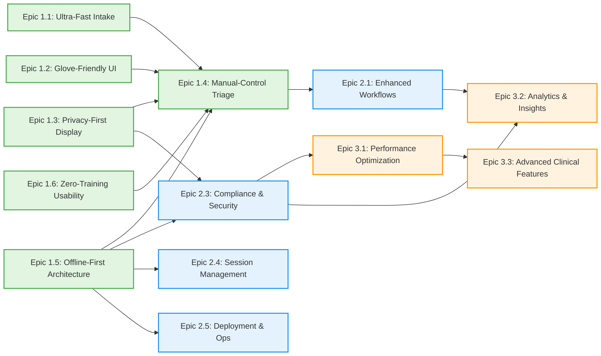

# Product Roadmap - Ragus

**Planning Horizon**: 18 months (Q1 2026 - Q2 2027)
**Status**: 🟡 Draft
**Last Updated**: 2026-02-17

---

## Roadmap Overview

The Ragus roadmap follows a phased approach aligned with the strategic pillars identified in the product strategy. The roadmap prioritizes clinical safety (P0), regulatory compliance (P0), and workflow velocity (P0) in Phase 1, followed by enhanced functionality and user experience improvements in Phase 2, with advanced features and optimization in Phase 3.

Each phase targets a specific deployment milestone:
- **Phase 1 (Q1-Q2 2026)**: Single-ER Pilot - Foundation functionality
- **Phase 2 (Q3 2026 - Q1 2027)**: Multi-Site Expansion - Core experience
- **Phase 3 (Q2 2027+)**: National Rollout - Advanced features

---

## Phase 1: Foundation (Q1-Q2 2026)

**Focus**: Core clinical workflows addressing P0 pain points (speed, privacy, safety)
**Target**: Single-ER Pilot deployment with 15-20 clinical staff
**Success Criteria**: <5-minute intake-to-triage time, zero GDPR/HIPAA violations, 99% uptime

### Epic 1.1: Ultra-Fast Intake Workflow
**Priority**: P0
**Strategic Pillar**: Clinical Workflow Velocity
**JTBDs Addressed**: JTBD-1.1, JTBD-1.3, JTBD-1.4

#### Features
| ID | Feature | Priority | JTBD | Pain Points | Status |
|----|---------|----------|------|-------------|--------|
| US-1.1.1 | Minimal intake form (Name, DOB, Complaint only) | P0 | JTBD-1.1 | PP-1.1 | Planned |
| US-1.1.2 | Tab-enter keyboard navigation flow | P0 | JTBD-1.3 | PP-1.1 | Planned |
| US-1.1.3 | Emergency Bypass button for trauma cases | P0 | JTBD-1.4 | PP-1.1 | Planned |
| US-1.1.4 | Keyboard shortcuts for high-speed entry | P1 | JTBD-1.3 | PP-1.1 | Planned |
| US-1.1.5 | LWBS (Left Without Being Seen) one-click marking | P1 | JTBD-1.5 | PP-1.2 | Planned |

**Target Outcome**: <30-second intake time for urgent patients (baseline: 60-90 seconds)

---

### Epic 1.2: Glove-Friendly UI Design
**Priority**: P0
**Strategic Pillar**: Clinical Workflow Velocity
**JTBDs Addressed**: JTBD-1.2, JTBD-2.2

#### Features
| ID | Feature | Priority | JTBD | Pain Points | Status |
|----|---------|----------|------|-------------|--------|
| US-1.2.1 | 60x60px minimum touch targets for all interactive elements | P0 | JTBD-1.2, JTBD-2.2 | PP-1.3 | Planned |
| US-1.2.2 | Large vitals entry fields (BP, HR, O2, Temp) | P0 | JTBD-2.2 | PP-1.3 | Planned |
| US-1.2.3 | Glove-optimized touchscreen calibration | P1 | JTBD-1.2 | PP-1.3 | Planned |
| US-1.2.4 | Desktop and tablet responsive design consistency | P1 | JTBD-3.7 | PP-1.3 | Planned |

**Target Outcome**: >95% glove-friendly click accuracy (baseline: <80%)

---

### Epic 1.3: Privacy-First Public Display
**Priority**: P0
**Strategic Pillar**: Privacy-First Patient Experience
**JTBDs Addressed**: JTBD-4.1, JTBD-4.3, JTBD-4.5

#### Features
| ID | Feature | Priority | JTBD | Pain Points | Status |
|----|---------|----------|------|-------------|--------|
| US-1.3.1 | Initials+day patient ID generation (e.g., "LC-16") | P0 | JTBD-4.1 | PP-2.2 | Planned |
| US-1.3.2 | Collision counter for duplicate IDs (e.g., "LC-16-2") | P0 | JTBD-4.1 | PP-2.2 | Planned |
| US-1.3.3 | Category-based wait time display (no countdown timers) | P0 | JTBD-4.2 | PP-5.1 | Planned |
| US-1.3.4 | GDPR/HIPAA compliant public display (no full names) | P0 | JTBD-4.3 | PP-2.1 | Planned |
| US-1.3.5 | Family tracking via patient ID | P1 | JTBD-4.5 | PP-2.2 | Planned |

**Target Outcome**: Zero GDPR/HIPAA violations, >95% patient ID recognition

---

### Epic 1.4: Manual-Control Triage Board
**Priority**: P0
**Strategic Pillar**: Clinical Judgment Over Automation
**JTBDs Addressed**: JTBD-3.1, JTBD-3.2, JTBD-3.4

#### Features
| ID | Feature | Priority | JTBD | Pain Points | Status |
|----|---------|----------|------|-------------|--------|
| US-1.4.1 | Kanban board UI (To Be Triaged, 30m, 60m, 120m, Rest, With Doctor) | P0 | JTBD-3.2 | PP-3.2 | Planned |
| US-1.4.2 | Drag-and-drop patient cards with one-click time slot buttons | P0 | JTBD-3.1, JTBD-3.2 | PP-5.2 | Planned |
| US-1.4.3 | Auto-advance triage queue (next patient loads automatically) | P0 | JTBD-2.1 | PP-1.2 | Planned |
| US-1.4.4 | Sub-1-second public display updates via WebSocket | P0 | JTBD-3.4 | PP-3.2 | Planned |
| US-1.4.5 | Bulk patient update capability (multi-select + move) | P1 | JTBD-3.5 | PP-1.2 | Planned |

**Target Outcome**: 100% manual doctor control, <1-second display update latency

---

### Epic 1.5: Offline-First Architecture
**Priority**: P0
**Strategic Pillar**: Offline Reliability
**JTBDs Addressed**: JTBD-5.1

#### Features
| ID | Feature | Priority | JTBD | Pain Points | Status |
|----|---------|----------|------|-------------|--------|
| US-1.5.1 | On-premise Ubuntu VM + Docker Compose architecture | P0 | JTBD-5.1 | PP-3.1 | Planned |
| US-1.5.2 | Zero CDN dependencies (bundled assets) | P0 | JTBD-5.1 | PP-3.1 | Planned |
| US-1.5.3 | LAN-based WebSocket real-time updates | P0 | JTBD-5.1, JTBD-3.4 | PP-3.1, PP-3.2 | Planned |
| US-1.5.4 | Manual tarball deployment script (<15 min downtime) | P1 | JTBD-5.2 | PP-6.1 | Planned |

**Target Outcome**: 99.9% LAN uptime, zero data loss during internet outages

---

### Epic 1.6: Zero-Training Usability
**Priority**: P0
**Strategic Pillar**: Zero-Training Usability
**JTBDs Addressed**: JTBD-2.5

#### Features
| ID | Feature | Priority | JTBD | Pain Points | Status |
|----|---------|----------|------|-------------|--------|
| US-1.6.1 | Intuitive UI with logical workflow (intake → triage → doctor review) | P0 | JTBD-2.5 | PP-4.3 | Planned |
| US-1.6.2 | Discoverable actions (tooltips, inline help, contextual hints) | P0 | JTBD-2.5 | PP-4.3 | Planned |
| US-1.6.3 | Clear visual hierarchy (color-coded buttons, large labels) | P0 | JTBD-2.5 | PP-4.3 | Planned |
| US-1.6.4 | ESI level assignment with large color-coded buttons | P1 | JTBD-2.3 | PP-1.2 | Planned |

**Target Outcome**: Float staff productive within 30 seconds, <60-second triage time

---

## Phase 2: Core Experience (Q3 2026 - Q1 2027)

**Focus**: Enhanced functionality, regulatory compliance, and user experience optimization
**Target**: Multi-Site Expansion (5-10 emergency departments)
**Success Criteria**: >99.5% uptime, <15-minute deployment time, >8/10 NPS

### Epic 2.1: Enhanced Clinical Workflows
**Priority**: P1
**Strategic Pillar**: Clinical Workflow Velocity, Clinical Judgment Over Automation
**JTBDs Addressed**: JTBD-2.4, JTBD-3.3, JTBD-3.6

#### Features
| ID | Feature | Priority | JTBD | Pain Points | Status |
|----|---------|----------|------|-------------|--------|
| US-2.1.1 | Free-text clinical context notes for doctors | P1 | JTBD-2.4 | PP-5.2 | Planned |
| US-2.1.2 | Visual wait-time alerts (yellow at 110%, red at 150%) | P1 | JTBD-3.3 | PP-3.2 | Planned |
| US-2.1.3 | Behavioral risk flag (staff-only view, not public) | P1 | JTBD-3.6 | PP-5.2 | Planned |
| US-2.1.4 | Keyboard shortcuts optimization for power users | P2 | JTBD-1.3 | PP-1.1 | Planned |

**Target Outcome**: <5-minute triage time per patient (baseline: 10+ minutes)

---

### Epic 2.2: Dark Mode & Accessibility
**Priority**: P1
**Strategic Pillar**: Privacy-First Patient Experience, Zero-Training Usability
**JTBDs Addressed**: JTBD-1.6, JTBD-2.6, JTBD-4.4

#### Features
| ID | Feature | Priority | JTBD | Pain Points | Status |
|----|---------|----------|------|-------------|--------|
| US-2.2.1 | Dark mode for night shifts (auto-toggle at 19:00-07:00) | P1 | JTBD-1.6, JTBD-2.6 | PP-4.1 | Planned |
| US-2.2.2 | Public display dark mode for sensory overload reduction | P1 | JTBD-4.4 | PP-4.2 | Planned |
| US-2.2.3 | Manual dark mode toggle override | P2 | JTBD-1.6, JTBD-2.6 | PP-4.1 | Planned |
| US-2.2.4 | High-contrast mode for accessibility | P2 | JTBD-1.6 | PP-4.1 | Planned |

**Target Outcome**: Eye strain rating <3/10 for night shift (baseline: >5/10)

---

### Epic 2.3: Compliance & Security
**Priority**: P0
**Strategic Pillar**: Privacy-First Patient Experience
**JTBDs Addressed**: JTBD-5.3, JTBD-5.4

#### Features
| ID | Feature | Priority | JTBD | Pain Points | Status |
|----|---------|----------|------|-------------|--------|
| US-2.3.1 | 24-hour automatic patient data deletion (GDPR) | P0 | JTBD-5.3 | PP-2.1 | Planned |
| US-2.3.2 | Audit log system (30-day retention, anonymized IDs) | P0 | JTBD-5.3 | PP-2.1 | Planned |
| US-2.3.3 | LDAP/Active Directory authentication integration | P1 | JTBD-5.4 | PP-6.2 | Planned |
| US-2.3.4 | Role-based access control (write vs. view-only) | P1 | JTBD-5.4 | PP-6.2 | Planned |

**Target Outcome**: Zero compliance violations, automated audit log purge

---

### Epic 2.4: Session Management & Data Integrity
**Priority**: P1
**Strategic Pillar**: Offline Reliability
**JTBDs Addressed**: JTBD-5.5

#### Features
| ID | Feature | Priority | JTBD | Pain Points | Status |
|----|---------|----------|------|-------------|--------|
| US-2.4.1 | Autosave for partially completed forms (15-min timeout protection) | P1 | JTBD-5.5 | PP-6.2 | Planned |
| US-2.4.2 | Session recovery after browser crash | P2 | JTBD-5.5 | PP-6.2 | Planned |
| US-2.4.3 | Graceful WebSocket reconnection with state preservation | P1 | JTBD-3.4 | PP-3.2 | Planned |

**Target Outcome**: Zero data loss from session timeouts

---

### Epic 2.5: Deployment & Operations
**Priority**: P1
**Strategic Pillar**: Offline Reliability
**JTBDs Addressed**: JTBD-5.2

#### Features
| ID | Feature | Priority | JTBD | Pain Points | Status |
|----|---------|----------|------|-------------|--------|
| US-2.5.1 | Automated deployment script with rollback capability | P1 | JTBD-5.2 | PP-6.1 | Planned |
| US-2.5.2 | Docker container health checks and monitoring | P1 | JTBD-5.1 | PP-3.1 | Planned |
| US-2.5.3 | VM snapshot and daily backup system | P1 | JTBD-5.1 | PP-3.1 | Planned |
| US-2.5.4 | Hot standby VM for high availability | P2 | JTBD-5.1 | PP-3.1 | Planned |

**Target Outcome**: <15-minute deployment time, automated rollback on failure

---

## Phase 3: Advanced Features (Q2 2027+)

**Focus**: Scalability, optimization, and differentiation
**Target**: National Rollout (50+ emergency departments, 1,000+ clinical staff)
**Success Criteria**: $5M+ ARR, NPS >50, <1% critical bug rate

### Epic 3.1: Performance Optimization
**Priority**: P2
**Strategic Pillar**: Clinical Workflow Velocity
**JTBDs Addressed**: JTBD-3.4

#### Features
| ID | Feature | Priority | JTBD | Pain Points | Status |
|----|---------|----------|------|-------------|--------|
| US-3.1.1 | WebSocket connection pooling for high-volume sites | P2 | JTBD-3.4 | PP-3.2 | Future |
| US-3.1.2 | Database query optimization (sub-100ms response time) | P2 | JTBD-3.4 | PP-3.2 | Future |
| US-3.1.3 | Frontend bundle optimization (<500KB initial load) | P2 | JTBD-2.5 | PP-4.3 | Future |

**Target Outcome**: <500ms p95 response time for all user actions

---

### Epic 3.2: Analytics & Insights
**Priority**: P2
**Strategic Pillar**: Clinical Judgment Over Automation
**JTBDs Addressed**: N/A (New capability)

#### Features
| ID | Feature | Priority | JTBD | Pain Points | Status |
|----|---------|----------|------|-------------|--------|
| US-3.2.1 | Shift-level performance dashboard (intake time, triage time, queue length) | P2 | N/A | N/A | Future |
| US-3.2.2 | Anonymized patient flow analytics (peak hours, wait time trends) | P2 | N/A | N/A | Future |
| US-3.2.3 | Clinical staff productivity metrics (float vs. regular staff comparison) | P2 | N/A | N/A | Future |

**Target Outcome**: Data-driven workflow optimization insights

---

### Epic 3.3: Advanced Clinical Features
**Priority**: P2
**Strategic Pillar**: Clinical Workflow Velocity, Clinical Judgment Over Automation
**JTBDs Addressed**: N/A (New capability)

#### Features
| ID | Feature | Priority | JTBD | Pain Points | Status |
|----|---------|----------|------|-------------|--------|
| US-3.3.1 | Predictive wait time estimation based on shift patterns | P2 | N/A | N/A | Future |
| US-3.3.2 | Customizable Kanban board time slots per hospital | P2 | N/A | N/A | Future |
| US-3.3.3 | HL7/FHIR integration for EMR interoperability | P2 | N/A | N/A | Future |

**Target Outcome**: Hospital-specific workflow customization

---

## Feature-JTBD Mapping

| Feature ID | Feature Name | JTBD | Pain Points | Priority | Phase |
|------------|--------------|------|-------------|----------|-------|
| US-1.1.1 | Minimal intake form | JTBD-1.1 | PP-1.1 | P0 | 1 |
| US-1.1.2 | Tab-enter navigation | JTBD-1.3 | PP-1.1 | P0 | 1 |
| US-1.1.3 | Emergency Bypass button | JTBD-1.4 | PP-1.1 | P0 | 1 |
| US-1.1.4 | Keyboard shortcuts | JTBD-1.3 | PP-1.1 | P1 | 1 |
| US-1.1.5 | LWBS one-click marking | JTBD-1.5 | PP-1.2 | P1 | 1 |
| US-1.2.1 | 60x60px touch targets | JTBD-1.2, JTBD-2.2 | PP-1.3 | P0 | 1 |
| US-1.2.2 | Large vitals entry fields | JTBD-2.2 | PP-1.3 | P0 | 1 |
| US-1.2.3 | Glove-optimized touchscreen | JTBD-1.2 | PP-1.3 | P1 | 1 |
| US-1.2.4 | Desktop/tablet responsive design | JTBD-3.7 | PP-1.3 | P1 | 1 |
| US-1.3.1 | Initials+day patient ID | JTBD-4.1 | PP-2.2 | P0 | 1 |
| US-1.3.2 | ID collision counter | JTBD-4.1 | PP-2.2 | P0 | 1 |
| US-1.3.3 | Category-based wait times | JTBD-4.2 | PP-5.1 | P0 | 1 |
| US-1.3.4 | GDPR/HIPAA compliant display | JTBD-4.3 | PP-2.1 | P0 | 1 |
| US-1.3.5 | Family tracking via ID | JTBD-4.5 | PP-2.2 | P1 | 1 |
| US-1.4.1 | Kanban board UI | JTBD-3.2 | PP-3.2 | P0 | 1 |
| US-1.4.2 | Drag-and-drop + time slot buttons | JTBD-3.1, JTBD-3.2 | PP-5.2 | P0 | 1 |
| US-1.4.3 | Auto-advance triage queue | JTBD-2.1 | PP-1.2 | P0 | 1 |
| US-1.4.4 | Sub-1-second display updates | JTBD-3.4 | PP-3.2 | P0 | 1 |
| US-1.4.5 | Bulk patient updates | JTBD-3.5 | PP-1.2 | P1 | 1 |
| US-1.5.1 | On-premise Ubuntu VM + Docker | JTBD-5.1 | PP-3.1 | P0 | 1 |
| US-1.5.2 | Zero CDN dependencies | JTBD-5.1 | PP-3.1 | P0 | 1 |
| US-1.5.3 | LAN-based WebSocket | JTBD-5.1, JTBD-3.4 | PP-3.1, PP-3.2 | P0 | 1 |
| US-1.5.4 | Manual tarball deployment | JTBD-5.2 | PP-6.1 | P1 | 1 |
| US-1.6.1 | Intuitive UI workflow | JTBD-2.5 | PP-4.3 | P0 | 1 |
| US-1.6.2 | Discoverable actions | JTBD-2.5 | PP-4.3 | P0 | 1 |
| US-1.6.3 | Clear visual hierarchy | JTBD-2.5 | PP-4.3 | P0 | 1 |
| US-1.6.4 | ESI level color-coded buttons | JTBD-2.3 | PP-1.2 | P1 | 1 |
| US-2.1.1 | Clinical context notes | JTBD-2.4 | PP-5.2 | P1 | 2 |
| US-2.1.2 | Visual wait-time alerts | JTBD-3.3 | PP-3.2 | P1 | 2 |
| US-2.1.3 | Behavioral risk flag | JTBD-3.6 | PP-5.2 | P1 | 2 |
| US-2.1.4 | Keyboard shortcuts optimization | JTBD-1.3 | PP-1.1 | P2 | 2 |
| US-2.2.1 | Dark mode auto-toggle | JTBD-1.6, JTBD-2.6 | PP-4.1 | P1 | 2 |
| US-2.2.2 | Public display dark mode | JTBD-4.4 | PP-4.2 | P1 | 2 |
| US-2.2.3 | Dark mode manual override | JTBD-1.6, JTBD-2.6 | PP-4.1 | P2 | 2 |
| US-2.2.4 | High-contrast mode | JTBD-1.6 | PP-4.1 | P2 | 2 |
| US-2.3.1 | 24-hour data deletion | JTBD-5.3 | PP-2.1 | P0 | 2 |
| US-2.3.2 | Audit log system | JTBD-5.3 | PP-2.1 | P0 | 2 |
| US-2.3.3 | LDAP/AD integration | JTBD-5.4 | PP-6.2 | P1 | 2 |
| US-2.3.4 | Role-based access control | JTBD-5.4 | PP-6.2 | P1 | 2 |
| US-2.4.1 | Form autosave | JTBD-5.5 | PP-6.2 | P1 | 2 |
| US-2.4.2 | Session recovery | JTBD-5.5 | PP-6.2 | P2 | 2 |
| US-2.4.3 | WebSocket reconnection | JTBD-3.4 | PP-3.2 | P1 | 2 |
| US-2.5.1 | Automated deployment script | JTBD-5.2 | PP-6.1 | P1 | 2 |
| US-2.5.2 | Container health checks | JTBD-5.1 | PP-3.1 | P1 | 2 |
| US-2.5.3 | VM snapshot and backup | JTBD-5.1 | PP-3.1 | P1 | 2 |
| US-2.5.4 | Hot standby VM | JTBD-5.1 | PP-3.1 | P2 | 2 |
| US-3.1.1 | WebSocket connection pooling | JTBD-3.4 | PP-3.2 | P2 | 3 |
| US-3.1.2 | Database query optimization | JTBD-3.4 | PP-3.2 | P2 | 3 |
| US-3.1.3 | Frontend bundle optimization | JTBD-2.5 | PP-4.3 | P2 | 3 |
| US-3.2.1 | Shift performance dashboard | N/A | N/A | P2 | 3 |
| US-3.2.2 | Patient flow analytics | N/A | N/A | P2 | 3 |
| US-3.2.3 | Staff productivity metrics | N/A | N/A | P2 | 3 |
| US-3.3.1 | Predictive wait time estimation | N/A | N/A | P2 | 3 |
| US-3.3.2 | Customizable Kanban time slots | N/A | N/A | P2 | 3 |
| US-3.3.3 | HL7/FHIR EMR integration | N/A | N/A | P2 | 3 |

---

## Dependencies

### Critical Path Dependencies

1. **Phase 1 Foundation Dependencies**:
   - Epic 1.5 (Offline Architecture) is foundational - must be completed first to enable all other epics
   - Epic 1.1 (Ultra-Fast Intake) and Epic 1.2 (Glove-Friendly UI) are parallel workstreams
   - Epic 1.4 (Manual-Control Triage) depends on all other Phase 1 epics (integration point)

2. **Phase 2 Enhancement Dependencies**:
   - Epic 2.3 (Compliance & Security) depends on Epic 1.5 (Offline Architecture) and Epic 1.3 (Privacy-First Display)
   - Epic 2.4 (Session Management) requires Epic 1.5 (Offline Architecture) to be stable
   - Epic 2.5 (Deployment) can proceed in parallel with Epic 2.1-2.4

3. **Phase 3 Advanced Dependencies**:
   - Epic 3.1 (Performance) requires Epic 2.3 (Compliance) to ensure optimization doesn't compromise security
   - Epic 3.2 (Analytics) depends on Epic 2.1 (Enhanced Workflows) and Epic 2.3 (Compliance) for data collection infrastructure
   - Epic 3.3 (Advanced Clinical) requires Epic 3.1 (Performance) to handle increased complexity

---

## Release Notes

### Phase 1 Deliverables (Q1-Q2 2026)
**Milestone**: Single-ER Pilot Deployment

**What's Included**:
- ✅ Minimal intake form with <30-second processing for urgent patients
- ✅ Glove-friendly UI with 60x60px touch targets
- ✅ Privacy-compliant patient IDs (initials+day format)
- ✅ Manual-control Kanban board with drag-and-drop
- ✅ Offline-first architecture (99.9% LAN uptime)
- ✅ Zero-training float staff onboarding (<30 seconds)

**What's Not Included**:
- Dark mode (Phase 2)
- LDAP/AD authentication (Phase 2)
- Audit logs (Phase 2)
- Analytics dashboard (Phase 3)

---

### Phase 2 Deliverables (Q3 2026 - Q1 2027)
**Milestone**: Multi-Site Expansion (5-10 ERs)

**What's Included**:
- ✅ Dark mode for night shifts (auto-toggle)
- ✅ GDPR/HIPAA compliance features (24-hour data deletion, audit logs)
- ✅ LDAP/Active Directory integration
- ✅ Session autosave and recovery
- ✅ Automated deployment with rollback
- ✅ Visual wait-time alerts (yellow/red)

**What's Not Included**:
- Advanced analytics (Phase 3)
- HL7/FHIR integration (Phase 3)
- Predictive wait time estimation (Phase 3)

---

### Phase 3 Deliverables (Q2 2027+)
**Milestone**: National Rollout (50+ ERs)

**What's Included**:
- ✅ Performance optimization (sub-500ms p95 response time)
- ✅ Shift-level performance dashboard
- ✅ Anonymized patient flow analytics
- ✅ Predictive wait time estimation
- ✅ HL7/FHIR EMR integration (optional)
- ✅ Customizable Kanban board time slots

---

## Roadmap Assumptions & Risks

### Key Assumptions

| Assumption | Impact | Validation Method | Mitigation if Wrong |
|------------|--------|-------------------|---------------------|
| Float staff can learn system in <30 seconds | High | Usability testing with 10+ float nurses (Q2 2026) | Extend onboarding, add training materials |
| Glove-friendly UI achieves >95% click accuracy | High | User testing with gloves on touchscreens (Q1 2026) | Increase touch targets, adjust spacing |
| On-premise deployment meets security requirements | Critical | Security audits, compliance checklists (Q1 2026) | Add security controls, pursue SOC 2 certification |
| Kanban drag-and-drop works with gloves | Medium | User testing with triage doctors (Q2 2026) | Provide alternative one-click time slot buttons |
| WebSocket real-time updates work on hospital networks | High | Pre-deployment network assessment (Q1 2026) | Fallback to polling (5-second intervals) |

### Risk Register

| Risk ID | Risk | Impact | Likelihood | Mitigation | Owner |
|---------|------|--------|------------|------------|-------|
| R1 | Pilot hospital feedback reveals workflow misalignment | High | Medium | Weekly shadowing, iterative demos, co-design workshops | Product Manager |
| R2 | Float staff cannot achieve <60s triage time | High | Medium | Extensive usability testing, tooltips, progressive disclosure | UX Designer |
| R3 | On-premise deployment exceeds 15-minute downtime | Medium | Medium | Automated scripts, rollback procedures, staging validation | DevOps Engineer |
| R4 | LDAP/AD integration delays Phase 1 go-live | Medium | Medium | Phase 1 uses basic auth; LDAP deferred to Phase 2 | Backend Architect |
| R5 | Patient ID collisions cause confusion | Medium | High | Append collision counter ("LC-16-2"), high-volume testing | Backend Developer |
| R6 | WebSocket updates fail on hospital firewall/proxy | High | Low | Fallback to polling, pre-deployment network assessment | Backend Developer |

---

## Success Metrics by Phase

### Phase 1 Success Criteria
- Intake-to-triage time: 10+ minutes → <5 minutes
- Urgent patient intake time: 60-90 seconds → <30 seconds
- Glove-friendly click accuracy: <80% → >95%
- GDPR/HIPAA violations: Multiple → 0
- System uptime (LAN): Unknown → 99.9%
- Float staff onboarding time: Requires buddy → <30 seconds
- Patient ID recognition: <50% → >95%

### Phase 2 Success Criteria
- Hospitals deployed: 1 → 5-10
- Deployment time: 30+ minutes → <15 minutes
- Eye strain rating (night shift): >5/10 → <3/10
- Customer satisfaction (NPS): Unknown → >8/10
- Session timeout data loss: Multiple/shift → 0

### Phase 3 Success Criteria
- Hospitals deployed: 10 → 50+
- Clinical staff users: 100 → 1,000+
- Annual recurring revenue: Unknown → $5M+
- Net Promoter Score: 8 → 50+
- Critical bug rate: Unknown → <1%
- Response time (p95): Unknown → <500ms

---

**Document Status**: 🟡 Draft
**Created**: 2026-02-17
**Next Review**: 2026-03-17
**Owner**: Product Team
