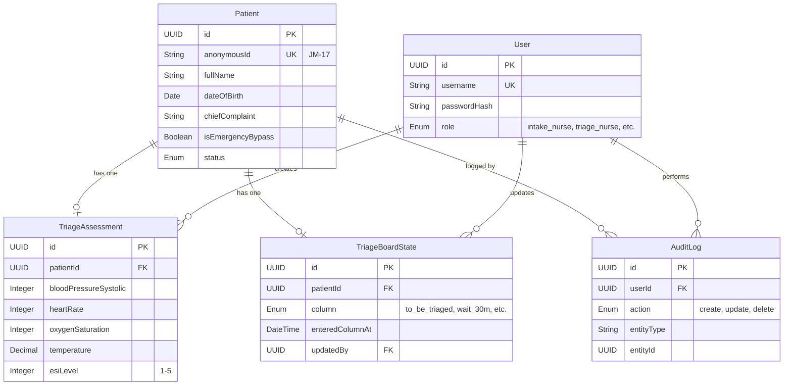

# Data Field Specifications - Ragus

**Created**: 2026-02-17
**Application**: Ragus - ER Triage System
**Total Entities**: 5

---

## 📊 Entity Overview

| Entity | Description | Volume | Key Relationships |
|--------|-------------|--------|-------------------|
| Patient | ER patient registration and triage data | High (~100-200/day per ER) | Has one: TriageAssessment |
| TriageAssessment | Clinical vitals and ESI level | High (~100-200/day) | Belongs to: Patient |
| User | Clinical staff (Intake, Triage, Doctor) | Low (~15-20 per ER) | Has many: AuditLog entries |
| TriageBoardState | Kanban board column assignments | High (~100-200 active) | Links to: Patient |
| AuditLog | Compliance audit trail (Phase 2) | Very High (~1000s/day) | Links to: User, Patient |

---

## 🗄️ Entity Definitions

### 1. Patient Entity

**Purpose**: Core patient identity and intake information
**Created By**: Intake Nurse (SCR-001)
**Used By**: All screens (SCR-001, SCR-002, SCR-003, SCR-004)

#### Field Specifications

| Field | Type | Length | Required | Default | Validation | Visibility | Notes |
|-------|------|--------|----------|---------|------------|------------|-------|
| **id** | UUID | 36 | Yes | Auto-generated | UUID format | Staff only | Primary key |
| **anonymousId** | String | 10 | Yes | Auto-generated | Pattern: `[A-Z]{2}-\d{2}(-\d+)?` | Public | Initials+day, e.g., "JM-17" or "JM-17-2" |
| **fullName** | String | 100 | Yes (Emergency Bypass: No) | N/A | Min 2 chars, max 100 | Staff only | Full legal name |
| **dateOfBirth** | Date | N/A | Yes (Emergency Bypass: No) | N/A | Date ≤ today, age ≥ 0 | Staff only | ISO 8601 format |
| **chiefComplaint** | String | 500 | Yes | N/A | Min 5 chars, max 500 | Staff only | Primary reason for ER visit |
| **registrationTime** | DateTime | N/A | Yes | Auto (server time) | ISO 8601 timestamp | Staff only | When intake completed |
| **isEmergencyBypass** | Boolean | N/A | Yes | false | true/false | Staff only | Trauma flag (skipped DOB) |
| **lwbsFlag** | Boolean | N/A | Yes | false | true/false | Staff only | "Left Without Being Seen" |
| **status** | Enum | N/A | Yes | "registered" | See Status enum below | Staff only | Current patient state |
| **createdAt** | DateTime | N/A | Yes | Auto | ISO 8601 timestamp | Staff only | Record creation time |
| **updatedAt** | DateTime | N/A | Yes | Auto | ISO 8601 timestamp | Staff only | Last modification time |
| **deletedAt** | DateTime | N/A | No | null | ISO 8601 timestamp | Staff only | Soft delete for GDPR (24-hour auto-delete) |

#### Status Enum Values

| Value | Description | Displayed As (Public) |
|-------|-------------|------------------------|
| `registered` | Intake complete, waiting for triage | "Waiting" |
| `in_triage` | Being assessed by triage nurse | "Being Triaged" |
| `triaged` | Triage complete, on board | "Waiting" |
| `with_nurse` | In nurse assessment area | "With Nurse" |
| `resting` | Resting area (post-triage, pre-doctor) | "Resting" |
| `with_doctor` | Currently with doctor | "With Doctor" |
| `discharged` | Treatment complete, left ER | (Removed from display) |
| `lwbs` | Left Without Being Seen | (Removed from display) |

#### Business Rules

1. **Anonymous ID Generation**:
   - Extract first letter of first name + first letter of last name
   - Append day of month (e.g., "John Martinez" on 17th → "JM-17")
   - If collision detected, append counter (e.g., "JM-17-2", "JM-17-3")

2. **Emergency Bypass**:
   - If `isEmergencyBypass = true`, `dateOfBirth` can be null
   - `fullName` and `chiefComplaint` still required

3. **GDPR/HIPAA Compliance**:
   - Auto-delete records 24 hours after `status = 'discharged'` OR `status = 'lwbs'`
   - Deletion: Set `deletedAt = NOW()`, anonymize `fullName` → "DELETED"

4. **LWBS Marking**:
   - Keyboard shortcut (Ctrl+L) sets `lwbsFlag = true`, `status = 'lwbs'`
   - Patient removed from public display immediately

---

### 2. TriageAssessment Entity

**Purpose**: Clinical vitals and ESI level assignment
**Created By**: Triage Nurse (SCR-002)
**Used By**: Triage Board (SCR-003), Public Display (SCR-004)

#### Field Specifications

| Field | Type | Length | Required | Default | Validation | Visibility | Notes |
|-------|------|--------|----------|---------|------------|------------|-------|
| **id** | UUID | 36 | Yes | Auto-generated | UUID format | Staff only | Primary key |
| **patientId** | UUID | 36 | Yes | N/A | Foreign key → Patient.id | Staff only | One-to-one relationship |
| **bloodPressureSystolic** | Integer | N/A | Yes | N/A | Min 40, max 300 | Staff only | BP top number (mmHg) |
| **bloodPressureDiastolic** | Integer | N/A | Yes | N/A | Min 20, max 200 | Staff only | BP bottom number (mmHg) |
| **heartRate** | Integer | N/A | Yes | N/A | Min 20, max 250 | Staff only | BPM |
| **oxygenSaturation** | Integer | N/A | Yes | N/A | Min 50, max 100 | Staff only | SpO2 percentage |
| **temperature** | Decimal | N/A | Yes | N/A | Min 30.0, max 45.0 | Staff only | Celsius, 1 decimal place |
| **esiLevel** | Integer | N/A | Yes | N/A | Min 1, max 5 | Staff only | Emergency Severity Index |
| **triageTime** | DateTime | N/A | Yes | Auto (server time) | ISO 8601 timestamp | Staff only | When triage completed |
| **triageNurseId** | UUID | 36 | Yes | Auto (current user) | Foreign key → User.id | Staff only | Who completed triage |
| **createdAt** | DateTime | N/A | Yes | Auto | ISO 8601 timestamp | Staff only | Record creation time |

#### ESI Level Mapping

| ESI Level | Color Code | Description | Wait Time Category |
|-----------|------------|-------------|---------------------|
| 1 | Red | Immediate life-saving intervention required | N/A (immediate) |
| 2 | Orange | Emergent - high risk of deterioration | <30 minutes |
| 3 | Yellow | Urgent - stable but needs care soon | 30-60 minutes |
| 4 | Green | Less urgent - stable, minor conditions | 60-120 minutes |
| 5 | Blue | Non-urgent - no acute symptoms | 120+ minutes |

#### Business Rules

1. **Vital Ranges**:
   - If `bloodPressureSystolic > 180` OR `bloodPressureDiastolic > 120`: Flag as hypertensive crisis
   - If `heartRate > 100` OR `heartRate < 60`: Flag as tachycardia/bradycardia
   - If `oxygenSaturation < 90`: Flag as hypoxia

2. **ESI Auto-Suggestions** (Future - Phase 2):
   - Low O2 + high HR → Suggest ESI 2
   - Normal vitals + minor complaint → Suggest ESI 4-5

3. **One-to-One Relationship**:
   - Each Patient has exactly one TriageAssessment
   - Cascade delete: If Patient deleted, TriageAssessment also deleted

---

### 3. User Entity

**Purpose**: Clinical staff authentication and role management
**Created By**: IT Admin (manual setup)
**Used By**: Login Screen (SCR-005), Audit Logs

#### Field Specifications

| Field | Type | Length | Required | Default | Validation | Visibility | Notes |
|-------|------|--------|----------|---------|------------|------------|-------|
| **id** | UUID | 36 | Yes | Auto-generated | UUID format | Admin only | Primary key |
| **username** | String | 50 | Yes | N/A | Alphanumeric, min 3 chars | Admin only | Login identifier |
| **passwordHash** | String | 255 | Yes | N/A | bcrypt hashed | Admin only | Never stored plain-text |
| **fullName** | String | 100 | Yes | N/A | Min 2 chars | Staff only | Display name |
| **role** | Enum | N/A | Yes | N/A | See Role enum below | Admin only | Determines screen access |
| **isActive** | Boolean | N/A | Yes | true | true/false | Admin only | Deactivate instead of delete |
| **createdAt** | DateTime | N/A | Yes | Auto | ISO 8601 timestamp | Admin only | Record creation time |
| **lastLoginAt** | DateTime | N/A | No | null | ISO 8601 timestamp | Admin only | Last successful login |

#### Role Enum Values

| Role | Screen Access | Permissions |
|------|---------------|-------------|
| `intake_nurse` | SCR-001 (Intake) | Create patients, mark LWBS |
| `triage_nurse` | SCR-002 (Triage) | Create triage assessments, view vitals |
| `triage_doctor` | SCR-003 (Board) | Move patients on board, view all data |
| `admin` | All screens | Full CRUD access, user management |

#### Business Rules

1. **Password Policy**:
   - Min 8 characters, at least 1 uppercase, 1 lowercase, 1 number
   - Hashed using bcrypt (cost factor 10)

2. **LDAP/Active Directory Integration** (Phase 2):
   - Replace username/password with LDAP authentication
   - Role mapping from LDAP groups (e.g., "ER_Intake" → `intake_nurse`)

3. **Session Timeout** (Phase 2):
   - 15 minutes inactivity → Session expires
   - Auto-save form data before expiration

---

### 4. TriageBoardState Entity

**Purpose**: Kanban board column assignments for patient flow management
**Created By**: Triage Doctor (SCR-003)
**Used By**: Triage Board (SCR-003), Public Display (SCR-004)

#### Field Specifications

| Field | Type | Length | Required | Default | Validation | Visibility | Notes |
|-------|------|--------|----------|---------|------------|------------|-------|
| **id** | UUID | 36 | Yes | Auto-generated | UUID format | Staff only | Primary key |
| **patientId** | UUID | 36 | Yes | N/A | Foreign key → Patient.id | Staff only | One-to-one relationship |
| **column** | Enum | N/A | Yes | "to_be_triaged" | See Column enum below | Staff only | Current Kanban column |
| **enteredColumnAt** | DateTime | N/A | Yes | Auto (server time) | ISO 8601 timestamp | Staff only | When patient moved to column |
| **previousColumn** | Enum | N/A | No | null | See Column enum below | Staff only | For undo/history |
| **updatedBy** | UUID | 36 | Yes | Auto (current user) | Foreign key → User.id | Staff only | Who moved patient |
| **updatedAt** | DateTime | N/A | Yes | Auto | ISO 8601 timestamp | Staff only | Last update time |

#### Column Enum Values

| Column | Display Label | Wait Time Category | Public Display Status |
|--------|---------------|---------------------|------------------------|
| `to_be_triaged` | "To Be Triaged" | N/A | "Waiting" |
| `wait_30m` | "30m Wait" | Short Wait (<30 min) | "Waiting" |
| `wait_60m` | "60m Wait" | Medium Wait (30-60 min) | "Waiting" |
| `wait_120m` | "120m Wait" | Long Wait (60-120 min) | "Waiting" |
| `rest` | "Rest" | Long Wait (120+ min) | "Resting" |
| `with_doctor` | "With Doctor" | N/A | "With Doctor" |

#### Business Rules

1. **Initial Assignment**:
   - When TriageAssessment completed → Auto-assign `column = 'to_be_triaged'`
   - Doctor manually moves to appropriate wait column

2. **WebSocket Real-Time Sync**:
   - On column change → Broadcast WebSocket event to Public Display (SCR-004)
   - Target latency: <1 second

3. **Bulk Move Support**:
   - Multi-select patients (Ctrl+Click) → Batch update `column` field
   - All selected patients get same `updatedBy`, `updatedAt`

4. **Wait Time Calculation**:
   - `waitTime = NOW() - enteredColumnAt`
   - Display category based on `column` (not calculated time)

---

### 5. AuditLog Entity (Phase 2)

**Purpose**: GDPR/HIPAA compliance audit trail
**Created By**: System (auto-logged on all actions)
**Used By**: Compliance reporting, admin audits

#### Field Specifications

| Field | Type | Length | Required | Default | Validation | Visibility | Notes |
|-------|------|--------|----------|---------|------------|------------|-------|
| **id** | UUID | 36 | Yes | Auto-generated | UUID format | Admin only | Primary key |
| **userId** | UUID | 36 | Yes | Auto (current user) | Foreign key → User.id | Admin only | Who performed action |
| **action** | Enum | N/A | Yes | N/A | See Action enum below | Admin only | What was done |
| **entityType** | String | 50 | Yes | N/A | "Patient", "TriageAssessment", etc. | Admin only | Which entity was affected |
| **entityId** | UUID | 36 | Yes | N/A | Foreign key to entity | Admin only | Which record |
| **changesBefore** | JSON | N/A | No | null | Valid JSON | Admin only | Old values (for updates) |
| **changesAfter** | JSON | N/A | No | null | Valid JSON | Admin only | New values (for updates) |
| **timestamp** | DateTime | N/A | Yes | Auto (server time) | ISO 8601 timestamp | Admin only | When action occurred |
| **ipAddress** | String | 45 | Yes | Auto | IPv4 or IPv6 | Admin only | Client IP |

#### Action Enum Values

| Action | Description |
|--------|-------------|
| `create` | New record created |
| `update` | Existing record modified |
| `delete` | Record deleted (soft or hard) |
| `view` | Sensitive data accessed |
| `login` | User logged in |
| `logout` | User logged out |

#### Business Rules

1. **Auto-Logging**:
   - All Patient and TriageAssessment changes logged automatically
   - Middleware intercepts all CRUD operations

2. **Retention**:
   - Audit logs retained for 30 days
   - After 30 days: Anonymize `userId` → "SYSTEM", delete `changesBefore`/`changesAfter`

3. **GDPR Compliance**:
   - On Patient deletion → AuditLog entries also anonymized
   - `entityId` replaced with "DELETED-{timestamp}"

---

## 🔗 Entity Relationships



---

## 🔐 Visibility & Access Control

### Role-Based Field Access

| Entity | Field | Intake Nurse | Triage Nurse | Doctor | Public Display |
|--------|-------|--------------|--------------|--------|----------------|
| Patient.fullName | Read/Write | ✅ | ✅ | ✅ | ❌ |
| Patient.anonymousId | Read | ✅ | ✅ | ✅ | ✅ |
| Patient.chiefComplaint | Read/Write | ✅ | ✅ | ✅ | ❌ |
| TriageAssessment.* | Read/Write | ❌ | ✅ | ✅ | ❌ |
| TriageBoardState.column | Read | ❌ | ✅ | Read/Write | Read (as status) |
| User.* | Read | ❌ | ❌ | ❌ | ❌ |

### Public Display Mapping

| Internal Status | Public Display Text |
|-----------------|---------------------|
| `registered`, `triaged` | "Waiting" |
| `in_triage` | "Being Triaged" |
| `with_nurse` | "With Nurse" |
| `resting` | "Resting" |
| `with_doctor` | "With Doctor" |
| `discharged`, `lwbs` | (Removed from display) |

---

## ✅ Validation Rules Summary

### Patient Entity

| Field | Validation |
|-------|------------|
| fullName | Min 2 chars, max 100, no special characters except space, hyphen, apostrophe |
| dateOfBirth | Date ≤ today, age ≥ 0 (not in future) |
| chiefComplaint | Min 5 chars, max 500, free text |
| anonymousId | Pattern: `[A-Z]{2}-\d{2}(-\d+)?` (e.g., "JM-17" or "JM-17-2") |

### TriageAssessment Entity

| Field | Validation |
|-------|------------|
| bloodPressureSystolic | Min 40, max 300 (mmHg) |
| bloodPressureDiastolic | Min 20, max 200 (mmHg) |
| heartRate | Min 20, max 250 (BPM) |
| oxygenSaturation | Min 50, max 100 (SpO2 %) |
| temperature | Min 30.0, max 45.0 (Celsius) |
| esiLevel | Min 1, max 5 (integer) |

### User Entity

| Field | Validation |
|-------|------------|
| username | Alphanumeric, min 3 chars, max 50, unique |
| password | Min 8 chars, 1 uppercase, 1 lowercase, 1 number |
| fullName | Min 2 chars, max 100 |

---

## 🎯 Data Integrity Constraints

### Primary Keys

- All entities use UUID (v4) as primary key
- UUIDs generated server-side (never client-generated)

### Foreign Keys

- All foreign keys reference UUID primary keys
- Cascade delete enabled for Patient → TriageAssessment, Patient → TriageBoardState
- Soft delete recommended for Patient entity (set `deletedAt`, preserve audit trail)

### Unique Constraints

- `Patient.anonymousId` must be unique per day (reset daily at midnight)
- `User.username` must be globally unique

### Indexes

| Entity | Field | Index Type | Reason |
|--------|-------|------------|--------|
| Patient | anonymousId | Unique | Public display lookups |
| Patient | status | Non-unique | Queue filtering |
| Patient | registrationTime | Non-unique | Time-based queries |
| TriageAssessment | patientId | Unique | One-to-one relationship |
| TriageBoardState | patientId | Unique | One-to-one relationship |
| User | username | Unique | Login lookups |

---

## 📊 Sample Data Records

### Example: Patient Record (Normal Intake)

```json
{
  "id": "550e8400-e29b-41d4-a716-446655440000",
  "anonymousId": "JM-17",
  "fullName": "John Martinez",
  "dateOfBirth": "1985-03-12",
  "chiefComplaint": "Chest pain, shortness of breath",
  "registrationTime": "2026-02-17T14:32:00Z",
  "isEmergencyBypass": false,
  "lwbsFlag": false,
  "status": "registered",
  "createdAt": "2026-02-17T14:32:00Z",
  "updatedAt": "2026-02-17T14:32:00Z",
  "deletedAt": null
}
```

### Example: TriageAssessment Record

```json
{
  "id": "660f9511-f3ac-52e5-b827-557766551111",
  "patientId": "550e8400-e29b-41d4-a716-446655440000",
  "bloodPressureSystolic": 140,
  "bloodPressureDiastolic": 90,
  "heartRate": 88,
  "oxygenSaturation": 96,
  "temperature": 37.2,
  "esiLevel": 3,
  "triageTime": "2026-02-17T14:38:00Z",
  "triageNurseId": "770g0622-g4bd-63f6-c938-668877662222",
  "createdAt": "2026-02-17T14:38:00Z"
}
```

### Example: TriageBoardState Record

```json
{
  "id": "880h1733-h5ce-74g7-d049-779988773333",
  "patientId": "550e8400-e29b-41d4-a716-446655440000",
  "column": "wait_60m",
  "enteredColumnAt": "2026-02-17T14:40:00Z",
  "previousColumn": "wait_30m",
  "updatedBy": "990i2844-i6df-85h8-e150-880099884444",
  "updatedAt": "2026-02-17T14:40:00Z"
}
```

---

## 🚨 GDPR/HIPAA Compliance Notes

### Personal Data (GDPR Article 4)

**Identifiable Data** (Staff-only, never public):
- `Patient.fullName`
- `Patient.dateOfBirth`
- `Patient.chiefComplaint` (may contain medical details)
- `TriageAssessment.*` (all vitals)

**Pseudonymous Data** (Public display allowed):
- `Patient.anonymousId` (initials + day only, no unique identifier outside 24h window)

### Data Retention

1. **24-Hour Auto-Delete**:
   - Patients with `status = 'discharged'` OR `status = 'lwbs'` → Deleted 24 hours after status change
   - Soft delete: Set `deletedAt`, anonymize `fullName` → "DELETED"

2. **Audit Log Retention**:
   - 30 days for active logs
   - After 30 days: Anonymize `userId`, delete `changesBefore`/`changesAfter`

3. **Right to Erasure (GDPR Article 17)**:
   - Manual delete button in admin panel (Phase 2)
   - Immediate soft delete + anonymization

---

## 📈 Data Volume Estimates

| Entity | Daily Volume | Monthly Volume | Annual Volume |
|--------|--------------|----------------|---------------|
| Patient | 100-200 records | 3,000-6,000 | 36,000-73,000 |
| TriageAssessment | 100-200 records | 3,000-6,000 | 36,000-73,000 |
| TriageBoardState | 500-1,000 updates | 15,000-30,000 | 180,000-365,000 |
| User | 0-5 new users | 0-20 | 0-50 |
| AuditLog (Phase 2) | 1,000-2,000 logs | 30,000-60,000 | 365,000-730,000 |

**Storage Estimate** (per year, single ER):
- Patients + Triage: ~50 MB (with 24-hour auto-delete)
- Board State: ~200 MB (high-frequency updates)
- Audit Logs: ~500 MB (30-day retention)
- **Total**: ~750 MB/year (negligible for modern storage)

---

## 🎯 Coverage Summary

### JTBD Coverage

| JTBD | Data Support |
|------|--------------|
| JTBD-1.1 (Fast intake) | `Patient` entity with minimal required fields |
| JTBD-1.4 (Emergency Bypass) | `Patient.isEmergencyBypass` flag, DOB nullable |
| JTBD-2.1 (Auto-advance triage) | `TriageAssessment` completion triggers queue update |
| JTBD-3.1 (One-click state changes) | `TriageBoardState.column` enum for Kanban |
| JTBD-4.1 (Anonymous patient IDs) | `Patient.anonymousId` generation logic |
| JTBD-5.3 (GDPR compliance) | 24-hour auto-delete, `deletedAt` field |

---

**Generated by**: Discovery_SpecDataModel v3.0.0
**Project Classification**: FULL_STACK
**Data Entities**: 5 (Patient, TriageAssessment, User, TriageBoardState, AuditLog)
