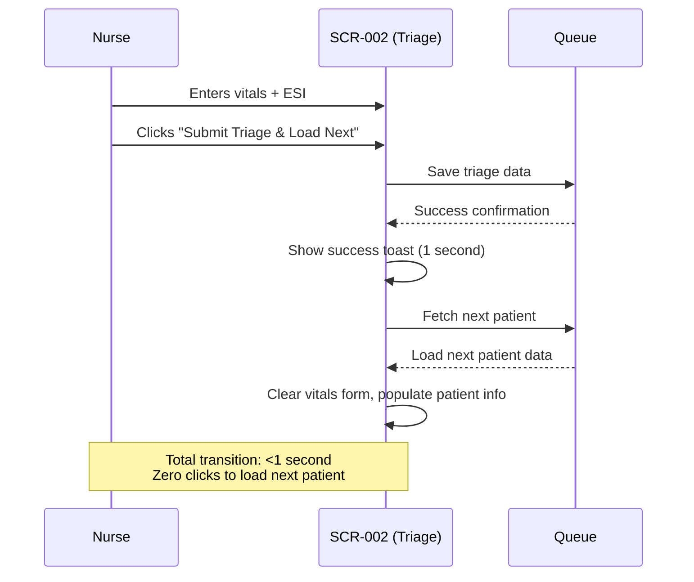
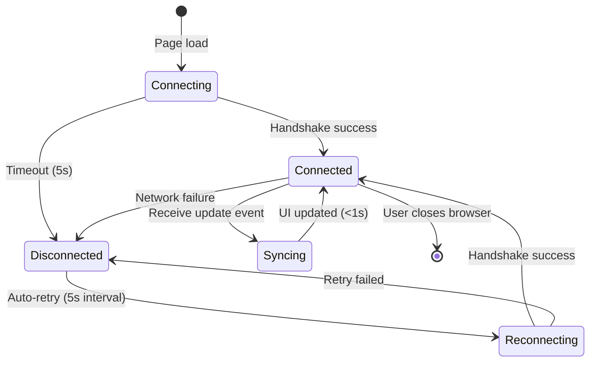

# Interaction Patterns - Ragus

**Created**: 2026-02-17
**Application**: Ragus - ER Triage System
**Pattern Categories**: 7

---

## 📋 Interaction Pattern Overview

| Pattern ID | Pattern Name | Screens | Purpose |
|------------|--------------|---------|---------|
| IP-001 | Glove-Friendly Touch Targets | SCR-001, SCR-002 | Large touch areas for gloved/sanitized hands |
| IP-002 | Keyboard-First Workflow | SCR-001, SCR-002 | Tab-Enter navigation for speed |
| IP-003 | Auto-Advance Forms | SCR-002 | Zero-click progression through queue |
| IP-004 | Emergency Bypass | SCR-001 | <5 second intake for trauma cases |
| IP-005 | Drag-and-Drop State Management | SCR-003 | Intuitive patient flow control |
| IP-006 | Real-Time Sync (WebSocket) | SCR-003, SCR-004 | <1 second update latency |
| IP-007 | Loading & Error States | All screens | User feedback during async operations |

---

## 🎯 Pattern Details

### IP-001: Glove-Friendly Touch Targets

**Screens**: SCR-001 (Intake), SCR-002 (Triage)
**JTBD**: JTBD-1.2 (Work effectively with gloves), JTBD-2.2 (Large vitals entry fields)
**Pain Points**: PP-1.3 (Poor UX for gloved/sanitized hands)

#### Design Specifications

| Element Type | Minimum Size | Padding | Notes |
|--------------|--------------|---------|-------|
| Primary Action Button | 80px height × 200px width | 20px all sides | "Submit Intake", "Emergency Bypass" |
| Secondary Button | 60px height × 150px width | 16px all sides | "Clear Form", "Bulk Move" |
| Text Input Field | 80px height | 16px vertical | Name, DOB, Complaint, Vitals |
| ESI Level Buttons | 100px height × 300px width | 20px all sides | Color-coded (Red, Orange, Yellow, Green, Blue) |
| Patient Cards (Kanban) | 120px height × 180px width | 12px all sides | Draggable cards on triage board |
| Interactive Icons | 60×60px minimum | 12px all sides | Close, Edit, Delete icons |

#### Touch Behavior

```typescript
// Pseudo-code for touch target logic
TouchTarget {
  minSize: "60×60px",
  hoverState: false, // No hover for touch (gloves don't hover)
  activeState: {
    feedback: "visual_scale", // Button scales down 2% on press
    duration: "150ms",
    color: "darken(10%)" // Visual confirmation
  },
  tapDelay: "0ms", // No 300ms delay (fast-tap mode)
  multiTouch: false // Single-touch only (prevents accidental palm touches)
}
```

#### Accessibility Notes

- **No hover states**: Gloved fingers don't trigger hover events
- **Visual click feedback**: Button press shows immediate scale animation (2% shrink)
- **Large tap targets**: Exceeds WCAG AAA guidelines (24×24px) by 2.5x minimum
- **Spacing**: 12px minimum between interactive elements (prevents mis-taps)

---

### IP-002: Keyboard-First Workflow

**Screens**: SCR-001 (Intake), SCR-002 (Triage)
**JTBD**: JTBD-1.3 (Keyboard shortcuts for speed)
**Pain Points**: PP-1.1 (Slow patient intake)

#### Keyboard Shortcuts

| Shortcut | Action | Screen | Context |
|----------|--------|--------|---------|
| **Tab** | Next field | SCR-001, SCR-002 | Move forward through form fields |
| **Shift+Tab** | Previous field | SCR-001, SCR-002 | Move backward through form fields |
| **Enter** | Submit form | SCR-001, SCR-002 | Submit intake/triage (if all required fields filled) |
| **Ctrl+S** | Submit (alternative) | SCR-001, SCR-002 | Alternative submit shortcut (muscle memory from other apps) |
| **Ctrl+L** | Mark LWBS | SCR-001 | "Left Without Being Seen" quick mark |
| **Ctrl+E** | Emergency Bypass | SCR-001 | Activate emergency bypass mode |
| **Esc** | Clear form | SCR-001, SCR-002 | Clear all fields (with confirmation) |

#### Tab Order

**SCR-001 (Intake Registration)**:
1. Full Name input
2. Date of Birth picker
3. Chief Complaint input
4. Submit Intake button
5. Emergency Bypass button (skipped in normal flow)

**SCR-002 (Triage Assessment)**:
1. BP Systolic input
2. BP Diastolic input
3. Heart Rate input
4. O2 Saturation input
5. Temperature input
6. ESI Level 1 button
7. ESI Level 2 button
8. ESI Level 3 button
9. ESI Level 4 button
10. ESI Level 5 button
11. Submit Triage & Load Next button

#### Behavior Specification

```typescript
// Pseudo-code for keyboard navigation
KeyboardNavigation {
  tabCycle: "loop", // Tab from last field → first field
  skipDisabled: true, // Skip disabled fields in tab order
  enterSubmit: {
    enabled: true,
    condition: "allRequiredFieldsFilled()",
    preventDefault: true // Don't trigger button click if form invalid
  },
  escClear: {
    confirmation: true, // Show "Clear form? Unsaved data will be lost"
    restoreFocus: "firstField" // Focus on first field after clear
  }
}
```

#### Visual Focus Indicators

- **Focus ring**: 3px solid blue outline (WCAG AAA contrast 7:1)
- **Focus state**: Never removed (accessibility requirement)
- **Skip links**: Hidden "Skip to main content" link for screen readers

---

### IP-003: Auto-Advance Forms

**Screens**: SCR-002 (Triage Assessment)
**JTBD**: JTBD-2.1 (Auto-advance triage queue)
**Pain Points**: PP-1.2 (Intake bottlenecks)

#### Behavior Flow



#### Animation Timing

| Phase | Duration | Animation | Purpose |
|-------|----------|-----------|---------|
| Submit (loading) | 200ms | Spinner on submit button | Show processing |
| Success toast | 1000ms | Green toast fade-in/out | Confirm save |
| Form clear | 150ms | Fade-out old data | Visual transition |
| Next patient load | 300ms | Fade-in new data | Smooth transition |
| **Total** | **1650ms** | Seamless progression | Keep nurse in flow |

#### Empty Queue Behavior

```
IF queue.isEmpty():
  Display: "No patients in queue - waiting for next patient"
  Action: Disable "Submit" button
  Visual: Gray out form fields
  Message: Green banner "You're all caught up!"
```

#### Skip Patient (Future - Phase 2)

```
Shortcut: Ctrl+N ("Next")
Action: Skip current patient (move to end of queue)
Use Case: Nurse needs bathroom break, phone call
Confirmation: "Skip patient LC-17? They'll be moved to end of queue."
```

---

### IP-004: Emergency Bypass

**Screens**: SCR-001 (Intake)
**JTBD**: JTBD-1.4 (Emergency Bypass for trauma)
**Pain Points**: PP-1.1 (Dangerous delays for urgent patients)

#### Activation Flow

```mermaid
%%{init: { 'flowchart': { 'useMaxWidth': false } } }%%
flowchart TB
    Start([Trauma patient arrives]) --> Nurse[Intake nurse assesses urgency]
    Nurse --> Bypass{Click Emergency<br/>Bypass button?}

    Bypass -->|Yes - Critical| BypassMode[Bypass mode activated]
    Bypass -->|No - Standard| NormalFlow[Normal intake flow]

    BypassMode --> MinimalForm[Show minimal form:<br/>Name + Complaint only]
    MinimalForm --> QuickSubmit[Submit in ~5 seconds]
    QuickSubmit --> Board[Patient bypasses queue<br/>→ Goes to "W/Doctor" column]
    Board --> Flag[Auto-assign ESI-1<br/>Red flag indicator]

    NormalFlow --> FullForm[Full form:<br/>Name + DOB + Complaint]
    FullForm --> StandardSubmit[Submit in ~30 seconds]
    StandardSubmit --> Queue[Patient enters triage queue]

    style BypassMode fill:#ffcccc
    style QuickSubmit fill:#ff9999
    style Flag fill:#ff6666
```

#### UI Changes in Bypass Mode

| Element | Normal Mode | Bypass Mode |
|---------|-------------|-------------|
| DOB field | Required, visible | Hidden (skipped) |
| Form title | "Patient Intake" | "🚨 EMERGENCY BYPASS - Trauma Mode" (red background) |
| Submit button | Blue, "Submit Intake" | Red, "BYPASS TRIAGE - IMMEDIATE CARE" |
| Complaint field | 500 char max | 100 char max (quick entry) |
| Background | White | Light red (#ffe6e6) |

#### Keyboard Activation

```
Shortcut: Ctrl+E
Trigger: Emergency Bypass mode
Visual: Red flash animation (200ms)
Focus: Auto-focus on Name field
Confirmation: None (zero-click activation for speed)
```

#### Data Handling

```typescript
// Pseudo-code for bypass logic
EmergencyBypass {
  requiredFields: ["fullName", "chiefComplaint"],
  optionalFields: ["dateOfBirth"], // Can be filled later
  autoFields: {
    isEmergencyBypass: true,
    status: "with_doctor", // Bypass queue entirely
    esiLevel: 1 // Auto-assign highest priority
  },
  targetTime: "5 seconds", // From button click to submit
  backfillData: true // Intake nurse completes DOB later (Phase 2)
}
```

---

### IP-005: Drag-and-Drop State Management

**Screens**: SCR-003 (Triage Dashboard)
**JTBD**: JTBD-3.1 (One-click state changes), JTBD-3.2 (Manual control)
**Pain Points**: PP-5.2 (No automation surprises)

#### Drag Behavior

```typescript
// Pseudo-code for drag-and-drop
DragAndDrop {
  dragStart: {
    cursor: "grabbing",
    cardOpacity: 0.6,
    shadowElevation: "8px",
    dragPreview: "clone", // Show card clone under cursor
    originalCard: "dimmed" // Original card stays visible but dimmed
  },
  dragOver: {
    dropZone: "highlight", // Target column gets blue border
    invalidZone: "red_border", // Invalid drop targets show red
    feedback: "immediate" // Visual feedback <50ms
  },
  drop: {
    animation: "slide_to_position", // Card slides to final position
    duration: "300ms",
    easing: "ease-out",
    updateBoard: "optimistic", // Update UI immediately, sync to server async
    rollback: "on_server_error" // If server fails, revert card position
  }
}
```

#### Multi-Select Drag

```
Activation: Ctrl+Click on patient cards
Visual: Selected cards show blue border + checkmark overlay
Behavior:
  - Drag any selected card → All selected cards move together
  - Drop → All cards added to target column
  - Bulk move count: Max 10 cards at once (performance limit)
  - Cancel: Esc key or click outside cards
```

#### Drop Zone Visual Feedback

| State | Visual | Border | Background |
|-------|--------|--------|------------|
| Idle | Normal column | 1px gray | White |
| Hover (valid) | Highlighted column | 3px blue | Light blue (#e6f7ff) |
| Hover (invalid) | Blocked column | 3px red | Light red (#ffe6e6) |
| Dropping | Pulsing animation | 3px green | Light green (#e6ffe6) |

#### Undo Action (Future - Phase 2)

```
Shortcut: Ctrl+Z
Action: Revert last drag-and-drop move
Confirmation: None (instant undo)
History: Store last 10 moves per session
Toast: "Patient LC-17 moved back to 30m Wait"
```

---

### IP-006: Real-Time Sync (WebSocket)

**Screens**: SCR-003 (Triage Board), SCR-004 (Public Display)
**JTBD**: JTBD-3.4 (Real-time updates)
**Pain Points**: PP-3.2 (Out-of-sync displays)

#### WebSocket Connection Lifecycle



#### Event Types

| Event | Payload | Trigger | Target Screens |
|-------|---------|---------|----------------|
| `patient.moved` | `{ patientId, fromColumn, toColumn, timestamp }` | Doctor drags card on SCR-003 | SCR-003, SCR-004 |
| `patient.registered` | `{ patientId, anonymousId }` | Intake submits SCR-001 | SCR-003 |
| `patient.triaged` | `{ patientId, esiLevel }` | Triage submits SCR-002 | SCR-003 |
| `patient.discharged` | `{ patientId }` | Doctor marks discharge | SCR-003, SCR-004 |
| `board.bulk_update` | `{ patientIds[], targetColumn }` | Bulk move operation | SCR-003, SCR-004 |

#### Latency Targets

| Operation | Target Latency | Measured From | Measured To |
|-----------|----------------|---------------|-------------|
| Drag-and-drop | <1 second | Card drop on SCR-003 | Display update on SCR-004 |
| Intake submit | <2 seconds | Submit button click | Appear on triage board |
| Triage submit | <1 second | Submit button click | Appear on doctor board |
| Bulk move | <2 seconds | Move selected click | Display update on SCR-004 |

#### Reconnection Logic

```typescript
// Pseudo-code for WebSocket reconnection
Reconnection {
  maxRetries: 10,
  retryInterval: "5 seconds", // Exponential backoff: 5s, 10s, 20s, ...
  maxInterval: "60 seconds",
  onDisconnect: {
    showBanner: "yellow", // "Connection lost - updates paused"
    disableInteractions: false, // Allow offline work (optimistic updates)
    queueUpdates: true // Store changes locally, sync on reconnect
  },
  onReconnect: {
    showToast: "green", // "Connection restored"
    syncState: true, // Fetch full board state (prevent drift)
    replayQueue: true // Send queued updates to server
  }
}
```

#### Offline Behavior

```
Scenario: LAN network interruption
Board (SCR-003):
  - Continue allowing drag-and-drop (optimistic updates)
  - Queue changes in browser memory
  - Show yellow banner "Working offline - changes will sync when connection restores"
  - On reconnect: Replay queued changes, resolve conflicts (server wins)

Display (SCR-004):
  - Show yellow banner "Connection lost - updates paused"
  - Freeze display at last known state
  - No actions available (read-only screen)
```

---

### IP-007: Loading & Error States

**Screens**: All screens
**Purpose**: User feedback during async operations
**Design Principle**: Never leave user guessing

#### Loading States

| Interaction | Loading Indicator | Duration | Fallback |
|-------------|-------------------|----------|----------|
| Form submit | Spinner on submit button + disabled form | 200-500ms | If >5s, show "Still processing..." |
| Page load | Full-screen spinner with logo | 500-1000ms | If >5s, show error |
| Auto-advance (next patient) | Inline spinner below form | 300-500ms | If >3s, show "No patients in queue" |
| Drag-and-drop | Card follows cursor (no spinner) | <1s | If >2s, rollback + error toast |
| WebSocket reconnect | Small spinner in header + banner | 5-60s | After 10 retries, show "Connection failed - reload page" |

#### Error States

**Error Message Format**:
```
[Icon] [User-Friendly Message]
[Technical Details (collapsible)]
[Action Button]
```

**Examples**:

1. **Form Validation Error**:
   ```
   ❌ Please fill in all required fields
   Missing: Date of Birth
   [OK]
   ```

2. **Network Error**:
   ```
   ⚠️ Unable to save patient data
   Network connection lost. Your data is safe and will be saved when connection restores.
   [Retry Now] [Work Offline]
   ```

3. **Server Error**:
   ```
   ❌ Server error - please contact IT support
   Error code: 500 | Timestamp: 2026-02-17 14:32:18
   [Copy Error Details] [Reload Page]
   ```

4. **Duplicate Patient ID (Collision)**:
   ```
   ⚠️ Patient ID collision detected
   Patient "JM-17" already exists. Assigned new ID: "JM-17-2"
   [OK]
   ```

#### Toast Notifications

| Type | Color | Duration | Icon | Example |
|------|-------|----------|------|---------|
| Success | Green | 3 seconds | ✅ | "Patient JM-17 registered successfully" |
| Info | Blue | 5 seconds | ℹ️ | "Queue empty - waiting for next patient" |
| Warning | Yellow | 10 seconds | ⚠️ | "Connection lost - working offline" |
| Error | Red | Until dismissed | ❌ | "Failed to save triage data - retry required" |

#### Empty States

**SCR-002 (Triage) - No Patients**:
```
[Large icon: Empty queue]
No patients in queue

You're all caught up! The next patient will load automatically.

[Refresh Queue]
```

**SCR-003 (Board) - Empty Column**:
```
[Column header: "30m Wait"]
No patients in this stage

Patients will appear here when you drag them from "To Be Triaged"
```

**SCR-004 (Display) - No Active Patients**:
```
[Large icon: Hospital symbol]
No patients currently waiting

The ER is clear. New arrivals will appear here shortly.
```

---

## 🎨 Visual Feedback Patterns

### Feedback Timing Standards

| Feedback Type | Max Latency | Guideline |
|---------------|-------------|-----------|
| Button click | 50ms | Immediate visual response (scale, color change) |
| Form validation | 100ms | Real-time feedback as user types |
| Page load | 1 second | Full UI ready to interact |
| Network request | 2 seconds | Show progress indicator |
| Background sync | No indicator | Silent sync (unless error) |

### Animation Timing

| Animation | Duration | Easing | Use Case |
|-----------|----------|--------|----------|
| Button press | 150ms | ease-out | Click feedback |
| Form transition | 300ms | ease-in-out | Auto-advance next patient |
| Drag-and-drop | 300ms | ease-out | Card slides to column |
| Toast fade-in | 200ms | ease-in | Success/error message |
| Toast fade-out | 500ms | ease-out | Dismiss notification |
| Spinner rotation | 1000ms loop | linear | Loading indicator |

---

## ♿ Accessibility Patterns

### WCAG 2.1 AA Compliance

| Guideline | Implementation | Screens |
|-----------|----------------|---------|
| **Color Contrast** | 4.5:1 minimum for text, 3:1 for large text | All |
| **Keyboard Navigation** | Tab order logical, focus visible | SCR-001, SCR-002 |
| **Touch Target Size** | 60×60px minimum (exceeds 44×44px guideline) | SCR-001, SCR-002, SCR-003 |
| **Screen Reader Labels** | ARIA labels on all interactive elements | All |
| **Error Identification** | Red text + icon + description | SCR-001, SCR-002 |
| **Focus Indicators** | 3px blue outline (7:1 contrast) | All |

### Screen Reader Announcements

| Event | Announcement | Screen |
|-------|--------------|--------|
| Patient registered | "Patient JM-17 registered. Full name: John Martinez. Chief complaint: Chest pain." | SCR-001 |
| Triage complete | "Triage complete for patient JM-17. ESI Level 3. Next patient loading." | SCR-002 |
| Patient moved | "Patient JM-17 moved to 60-minute wait column." | SCR-003 |
| Connection lost | "Warning: Network connection lost. Working offline." | All |
| Connection restored | "Network connection restored. Syncing updates." | All |

---

## 🧪 Interaction Testing Scenarios

### Test Scenario 1: Glove-Friendly Touch (IP-001)

**Setup**: Triage nurse wearing latex gloves
**Steps**:
1. Open SCR-002 (Triage)
2. Tap BP Systolic field with gloved finger
3. Enter value using numeric keyboard
4. Tap ESI Level 3 button (yellow, 100×300px)
5. Tap "Submit Triage" button

**Expected**:
- All taps register correctly (>95% accuracy)
- No accidental mis-taps on adjacent elements
- Visual feedback on each tap (button press animation)

---

### Test Scenario 2: Auto-Advance (IP-003)

**Setup**: 5 patients in triage queue
**Steps**:
1. Complete triage for patient 1 (JM-17)
2. Click "Submit Triage & Load Next"
3. Observe transition to patient 2 (LC-17)
4. Repeat for patients 2-5

**Expected**:
- Total transition time <1.65 seconds per patient
- No need to click "Next Patient" button
- Empty queue message after patient 5
- Success toast shown for each save

---

### Test Scenario 3: WebSocket Sync (IP-006)

**Setup**: Doctor at SCR-003, family viewing SCR-004
**Steps**:
1. Doctor drags patient "JM-17" from "30m Wait" to "With Doctor"
2. Measure latency until SCR-004 updates
3. Disconnect LAN network
4. Doctor moves patient "LC-17" to "Rest"
5. Reconnect LAN network
6. Verify SCR-004 syncs

**Expected**:
- Initial update latency <1 second
- Offline banner shown on disconnect
- Queued changes replay on reconnect
- No data loss or duplicate moves

---

## 📊 Coverage Summary

### JTBD Coverage

| JTBD | Interaction Pattern |
|------|---------------------|
| JTBD-1.1 (Fast intake) | IP-002 (Keyboard-first), IP-004 (Emergency Bypass) |
| JTBD-1.2 (Glove-friendly) | IP-001 (Large touch targets) |
| JTBD-1.3 (Keyboard shortcuts) | IP-002 (Tab-Enter flow, Ctrl+L, Ctrl+E) |
| JTBD-1.4 (Emergency Bypass) | IP-004 (5-second trauma mode) |
| JTBD-2.1 (Auto-advance) | IP-003 (Zero-click progression) |
| JTBD-3.1 (One-click moves) | IP-005 (Drag-and-drop) |
| JTBD-3.4 (Real-time updates) | IP-006 (WebSocket <1s latency) |

### Feature Coverage

| Epic | Patterns |
|------|----------|
| Epic 1.1: Ultra-Fast Intake | IP-002, IP-004 |
| Epic 1.2: Glove-Friendly UI | IP-001 |
| Epic 1.4: Manual-Control Triage | IP-005, IP-006 |
| Epic 1.6: Zero-Training Usability | IP-003, IP-007 |

---

## 🎯 Design Principles Applied

1. **Glove-First Design**: 60×60px minimum touch targets, no hover states
2. **Speed-First Interactions**: Keyboard shortcuts, auto-advance, <1s transitions
3. **Zero-Training UX**: Intuitive drag-and-drop, clear visual feedback, empty states
4. **Real-Time by Default**: WebSocket updates, <1s latency, offline resilience
5. **Error Transparency**: Clear error messages, actionable buttons, no silent failures

---

**Generated by**: Discovery_SpecInteractions v4.0.0
**Smart Obsolescence Handling**: Enabled
**Project Classification**: FULL_STACK
**Interaction Patterns**: 7 (IP-001 through IP-007)
