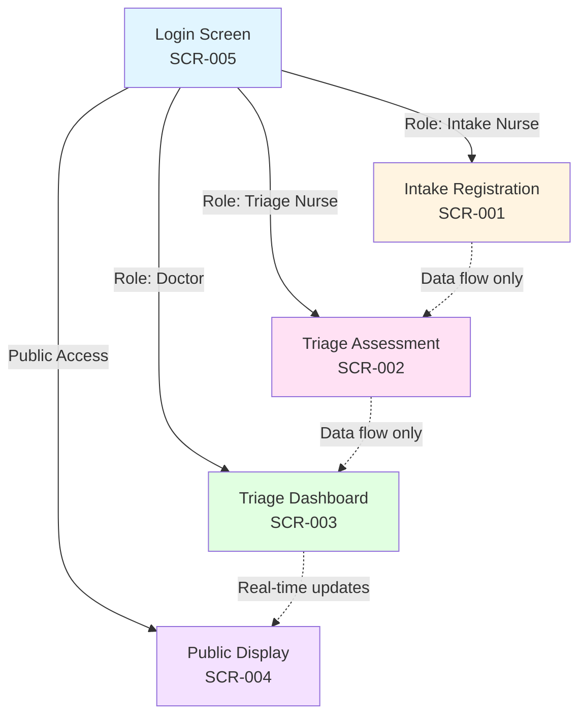
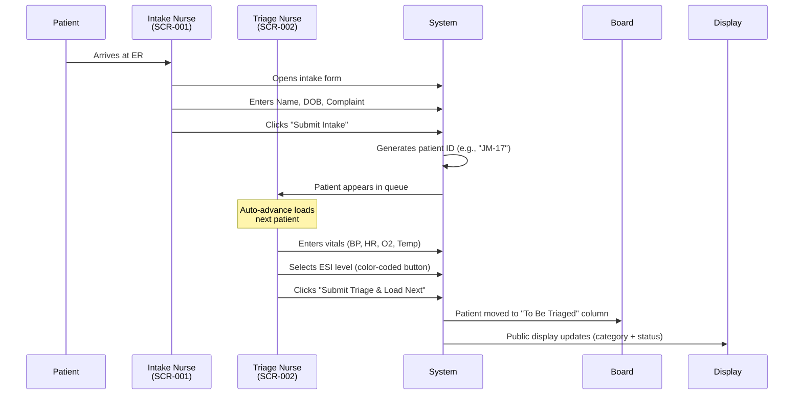
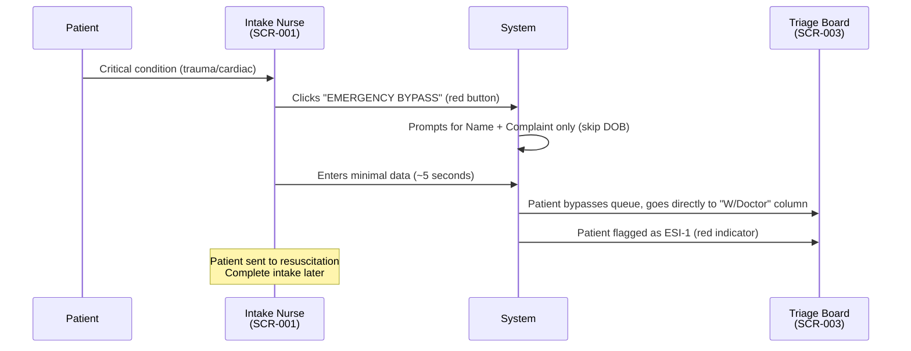
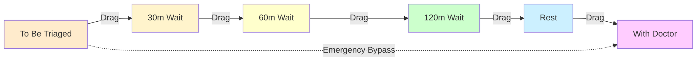
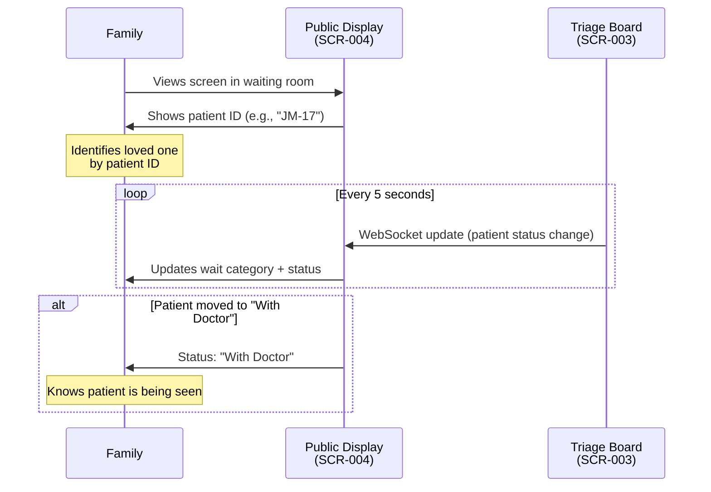
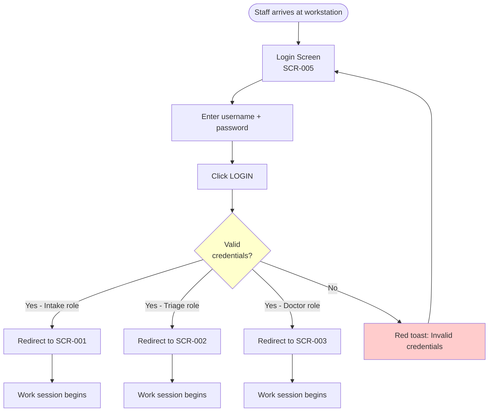

# Navigation Flows - Ragus

**Created**: 2026-02-17
**Application**: Ragus - ER Triage System
**Total Screens**: 5

---

## 🗺️ Site Map

### Role-Based Navigation Architecture

Ragus uses a **role-based single-screen architecture** - each staff role is assigned to a dedicated workstation with a specific screen. There is **no traditional navigation menu** because:

1. **Intake nurses** stay at the intake desk (SCR-001)
2. **Triage nurses** stay at the triage station (SCR-002)
3. **Triage doctors** stay at the control board (SCR-003)
4. **Public display** is read-only, mounted in waiting room (SCR-004)
5. **Login** is the entry point for all staff (SCR-005)

**Navigation Type**: Role-locked, single-screen per role (no inter-screen navigation)

---

## 🚦 Primary User Flows

### Flow 1: Patient Intake to Triage (Critical Path)

**Actors**: Intake Nurse (Jenny) + Triage Nurse (Michael)
**Trigger**: Patient arrives at ER entrance
**JTBD**: JTBD-1.1 (Process urgent patients instantly), JTBD-2.1 (Assess patients efficiently)

#### Normal Flow

**Steps**:
1. **Intake** (SCR-001): Jenny registers patient (Name, DOB, Complaint) → ~30 seconds
2. **Data handoff**: Patient enters triage queue automatically
3. **Triage** (SCR-002): Michael assesses vitals + ESI → ~60 seconds
4. **Board update**: Patient appears on Kanban board (SCR-003)
5. **Public update**: Patient ID visible on display (SCR-004) with wait category

**Success Criteria**:
- Total intake-to-triage time: <5 minutes (target: <90 seconds)
- Zero data entry errors
- Patient ID collision handled automatically (e.g., "JM-17-2")

---

#### Emergency Bypass Flow (Trauma)

**Trigger**: Critical patient (cardiac arrest, severe trauma, unconscious)
**JTBD**: JTBD-1.4 (Emergency Bypass for trauma)

**Steps**:
1. **Emergency detected**: Jenny clicks "Emergency Bypass" button
2. **Minimal intake**: Name + Complaint only (DOB optional)
3. **Bypass queue**: Patient skips triage, goes directly to doctor
4. **Auto-assign ESI-1**: System assumes highest priority
5. **Backfill data**: Complete intake details after patient stabilized

**Success Criteria**:
- Intake time: <5 seconds
- Patient immediately visible on doctor's board (SCR-003)
- No workflow blocking for missing data

---

### Flow 2: Triage Board Management (Doctor Control)

**Actor**: Triage Doctor (Sarah)
**Trigger**: Patient completes triage assessment
**JTBD**: JTBD-3.1 (One-click patient state changes), JTBD-3.2 (Manual triage board control)

#### Kanban Board Workflow

**Steps**:
1. **Patient appears**: Newly triaged patient in "To Be Triaged" column
2. **Doctor reviews**: Checks ESI level, vitals, complaint
3. **Drag-and-drop**: Moves patient card to appropriate wait column
4. **Real-time sync**: Public display updates <1 second (WebSocket)
5. **Repeat**: Next patient processed

**Bulk Operations**:
- **Ctrl+Click**: Multi-select patient cards
- **Move Selected**: Bulk move to target column (e.g., move 5 patients to "Rest")
- **Use case**: End-of-shift handoffs, bulk category updates

**Success Criteria**:
- <1 second update latency to public display (SCR-004)
- 100% manual control (no auto-progression)
- Drag-and-drop accuracy >95%

---

### Flow 3: Public Display Monitoring (Patient/Family)

**Actor**: Patient Advocate (Maria) + Patients/Families
**Trigger**: Patient registered and triaged
**JTBD**: JTBD-4.1 (Anonymous patient IDs), JTBD-4.5 (Family tracking)

#### Patient Tracking Flow

**Steps**:
1. **Initial check**: Family locates patient ID on display (e.g., "JM-17")
2. **Wait category**: Sees "Medium Wait (30-60 minutes)"
3. **Status updates**: Monitors status changes ("Waiting" → "With Nurse" → "Waiting" → "With Doctor")
4. **Completion**: Patient disappears from display when discharged

**Privacy Features**:
- **No full names**: Only initials + day (e.g., "JM-17")
- **No medical details**: Status is generic ("Waiting", "With Doctor")
- **GDPR/HIPAA compliant**: 24-hour auto-delete after discharge

**Success Criteria**:
- <1 second update latency from board changes
- Zero privacy violations
- Patient ID collision handled (e.g., "JM-17-2" for duplicate initials)

---

### Flow 4: Session Management (Login/Logout)

**Actor**: All staff
**Trigger**: Shift start/end
**JTBD**: JTBD-5.4 (Role-based authentication)

#### Login Flow

**Steps**:
1. **Workstation boot**: Login screen auto-loads (SCR-005)
2. **Credentials**: Staff enters username + password
3. **Authentication**: System validates against LDAP/AD (future: Phase 2)
4. **Role detection**: User record specifies role (Intake, Triage, Doctor)
5. **Auto-redirect**: Staff immediately sees their assigned screen
6. **Session active**: No logout button (workstation-locked to role)

**Logout Flow**:
- **Method**: Browser close or system logout (no in-app logout)
- **Reason**: Workstations are role-specific, no need to switch screens
- **Session timeout**: 15 minutes inactivity (Phase 2 feature)

**Success Criteria**:
- <1 second authentication + redirect
- Zero role mismatches (nurse can't access doctor screen)
- Offline mode: LAN authentication works without internet

---

## 🔀 Screen Transition Matrix

| From Screen | To Screen | Transition Type | Trigger | Duration |
|-------------|-----------|-----------------|---------|----------|
| SCR-005 (Login) | SCR-001 (Intake) | Redirect | Successful login (Intake role) | <1 second |
| SCR-005 (Login) | SCR-002 (Triage) | Redirect | Successful login (Triage role) | <1 second |
| SCR-005 (Login) | SCR-003 (Board) | Redirect | Successful login (Doctor role) | <1 second |
| SCR-005 (Login) | SCR-004 (Display) | Direct load | Public access (no auth) | <1 second |
| SCR-001 (Intake) | SCR-001 (Intake) | No navigation | Continuous workflow (same screen) | N/A |
| SCR-002 (Triage) | SCR-002 (Triage) | Auto-advance | Submit triage → next patient loads | <1 second |
| SCR-003 (Board) | SCR-003 (Board) | No navigation | Continuous workflow (same screen) | N/A |
| SCR-004 (Display) | SCR-004 (Display) | Auto-refresh | WebSocket update every 5 seconds | <1 second |

**Key Insight**: There is **no inter-screen navigation** for staff roles. Each role is locked to their assigned screen.

---

## 🎯 Navigation Patterns

### Pattern 1: Role-Locked Single-Screen

**Use Case**: ER workstations are dedicated hardware
**Screens**: SCR-001, SCR-002, SCR-003
**Behavior**:
- Staff log in once at shift start
- See only their assigned screen (no menu, no screen switching)
- Work continuously on single screen until shift end
- Browser close = logout

**Rationale**:
- Prevents workflow interruptions (no accidental navigation)
- Reduces cognitive load (zero navigation decisions)
- Matches physical workstation setup (1 desk = 1 role)

---

### Pattern 2: Data Flow (No User Navigation)

**Use Case**: Patient progression through triage stages
**Flow**: SCR-001 → SCR-002 → SCR-003 → SCR-004
**Behavior**:
- Patient data flows automatically between screens
- Staff never manually "send" data (submit = auto-forward)
- Real-time WebSocket keeps all screens in sync

**Example**:
1. Jenny (SCR-001) submits intake → Patient appears in Michael's queue (SCR-002)
2. Michael (SCR-002) submits triage → Patient appears on Sarah's board (SCR-003)
3. Sarah (SCR-003) moves patient to "With Doctor" → Display (SCR-004) updates

**Rationale**:
- Zero-click handoffs between staff
- No "handoff" buttons or confirmation screens
- Data instantly available to next role

---

### Pattern 3: Auto-Advance Workflow

**Use Case**: High-volume triage processing
**Screens**: SCR-002 (Triage)
**Behavior**:
- Submit current patient → Next patient auto-loads
- No queue screen, no "Next Patient" button
- Continuous flow until queue empty

**Example**:
- Michael triages patient "JM-17" → Clicks "Submit Triage & Load Next"
- Screen immediately shows next patient "LC-17" with empty vitals form
- Michael repeats process without navigation decisions

**Rationale**:
- Matches ER workflow (process queue top-to-bottom)
- Eliminates clicks between patients
- Reduces triage time by ~10 seconds per patient

---

### Pattern 4: Real-Time Sync (No Refresh Button)

**Use Case**: Public display updates
**Screens**: SCR-004 (Display)
**Behavior**:
- WebSocket connection to triage board (SCR-003)
- Updates every 1-5 seconds automatically
- No manual refresh, no polling delays

**Example**:
- Sarah (SCR-003) drags "JM-17" to "With Doctor" column
- Display (SCR-004) updates within <1 second
- Family sees status change from "Waiting" to "With Doctor"

**Rationale**:
- Real-time patient tracking for families
- No stale data on public display
- Reduces anxiety (families see progress immediately)

---

## 📐 Navigation Design Decisions

### Decision 1: No Global Navigation Menu

**Rationale**:
- Each role uses a dedicated workstation (no need to switch screens)
- Prevents accidental navigation during high-stress situations
- Matches physical ER layout (intake desk ≠ triage station ≠ doctor office)

**Trade-off**:
- Pro: Zero navigation errors, faster workflows
- Con: Admin tasks require separate login (no multi-role support in Phase 1)

**Future**: Phase 2 may add role switching for float staff (nurses who cover multiple stations)

---

### Decision 2: Auto-Advance Triage Queue

**Rationale**:
- Reduces cognitive load (no "Who's next?" decision)
- Matches physical triage workflow (process top-to-bottom)
- Saves ~10 seconds per patient (no navigation clicks)

**Trade-off**:
- Pro: Faster triage, zero-click workflow
- Con: Nurse can't skip patients (must process in order)

**Future**: Phase 2 may add "Skip Patient" button for bathroom breaks, phone calls

---

### Decision 3: Real-Time WebSocket Updates

**Rationale**:
- Public display must show current wait times (no 5-minute polling delays)
- Doctors need instant board updates (no "Refresh Board" button)
- Offline-first architecture uses LAN-based WebSockets (no cloud dependency)

**Trade-off**:
- Pro: <1 second update latency, real-time patient tracking
- Con: Requires LAN infrastructure, no fallback to polling

**Technical**: WebSocket reconnection logic handles network hiccups (5-second retry)

---

## 🧭 User Journey Maps

### Journey 1: Intake Nurse (Jenny) - Morning Shift

**Scenario**: High-volume flu season, 12-hour day shift (07:00-19:00)

| Time | Action | Screen | JTBD | Notes |
|------|--------|--------|------|-------|
| 07:00 | Login at intake desk | SCR-005 | JTBD-5.4 | Enters username/password, redirects to SCR-001 |
| 07:02 | First patient arrives | SCR-001 | JTBD-1.1 | Name, DOB, Complaint → Submit → Patient "JM-07" created |
| 07:03 | Second patient (elderly, slow) | SCR-001 | JTBD-1.2 | Large touch targets, glove-friendly UI |
| 07:15 | Trauma patient (car accident) | SCR-001 | JTBD-1.4 | Clicks "EMERGENCY BYPASS" → Name + Complaint only → 5 seconds |
| 12:00 | Lunch break | N/A | N/A | Workstation locked, no logout |
| 12:30 | Resume shift | SCR-001 | N/A | No re-login needed (session preserved) |
| 18:50 | Patient left without being seen | SCR-001 | JTBD-1.5 | Keyboard shortcut Ctrl+L → LWBS marked |
| 19:00 | End of shift | N/A | N/A | Browser close = logout |

**Pain Points Resolved**:
- PP-1.1: Fast intake (<30 seconds) via minimal form
- PP-1.3: Glove-friendly UI (60x60px touch targets)

**Total Patients Processed**: ~40-60 per shift (60-90 seconds average per patient)

---

### Journey 2: Triage Doctor (Sarah) - Afternoon Shift

**Scenario**: Moderate volume, 8-hour shift (14:00-22:00)

| Time | Action | Screen | JTBD | Notes |
|------|--------|--------|------|-------|
| 14:00 | Login at control board | SCR-005 | JTBD-5.4 | Redirects to SCR-003 (Kanban board) |
| 14:02 | Review patient queue | SCR-003 | JTBD-3.2 | 8 patients in "To Be Triaged", 4 in "30m Wait" |
| 14:05 | Move patient "LC-14" to "60m Wait" | SCR-003 | JTBD-3.1 | Drag-and-drop → Public display updates <1 second |
| 14:10 | Bulk move 3 patients to "Rest" | SCR-003 | JTBD-3.5 | Ctrl+Click → Select 3 cards → Move Selected → "Rest" |
| 15:30 | Emergency patient arrives | SCR-003 | JTBD-1.4 | "AP-15" appears in "W/Doctor" column (bypassed queue) |
| 18:00 | Dinner break | N/A | N/A | Workstation locked |
| 22:00 | End of shift | N/A | N/A | Browser close = logout |

**Pain Points Resolved**:
- PP-3.2: Manual control (no automation surprises)
- PP-5.2: 100% doctor control of patient flow

**Total Decisions**: ~30-50 patient moves per shift (drag-and-drop workflow)

---

### Journey 3: Patient Family (Waiting Room)

**Scenario**: Family member tracking patient "JM-17" (Jenny Martinez)

| Time | Event | Screen | JTBD | Notes |
|------|-------|--------|------|-------|
| 09:15 | Patient arrives at ER | N/A | N/A | Intake nurse registers as "JM-17" |
| 09:18 | Family checks display | SCR-004 | JTBD-4.1 | Sees "JM-17" listed as "Short Wait (<30 min)" |
| 09:25 | Status update | SCR-004 | JTBD-4.5 | "JM-17" status changes to "Being Triaged" |
| 09:35 | Status update | SCR-004 | JTBD-4.2 | "JM-17" status changes to "Waiting" (moved to "30m Wait" column) |
| 10:05 | Status update | SCR-004 | JTBD-4.5 | "JM-17" status changes to "With Doctor" |
| 10:20 | Patient discharged | SCR-004 | N/A | "JM-17" disappears from display |

**Pain Points Resolved**:
- PP-2.2: Anonymous patient IDs (initials + day)
- PP-5.1: Category-based wait times (no anxiety-inducing countdown timers)

**Privacy Compliance**:
- No full names shown (GDPR/HIPAA compliant)
- Status is generic ("Waiting", "With Doctor", "With Nurse")

---

## 🔍 Edge Cases & Error States

### Edge Case 1: Duplicate Patient IDs

**Scenario**: Two patients with same initials arrive on same day (e.g., "John Martinez" and "Jane Moore")
**Solution**: Automatic collision counter appended (e.g., "JM-17", "JM-17-2")
**Screen**: SCR-001 (Intake), SCR-004 (Display)
**JTBD**: JTBD-4.1 (Anonymous patient IDs)

---

### Edge Case 2: Network Failure (WebSocket Disconnect)

**Scenario**: LAN network interruption, WebSocket disconnects
**Solution**:
- Display (SCR-004) shows yellow banner "Connection lost - updates paused"
- Auto-reconnect every 5 seconds
- Board (SCR-003) continues to work (offline-first architecture)
**Screen**: SCR-003, SCR-004
**JTBD**: JTBD-5.1 (Offline-first architecture)

---

### Edge Case 3: Empty Triage Queue

**Scenario**: No patients waiting for triage
**Solution**:
- Triage screen (SCR-002) shows "No patients in queue - waiting for next patient"
- Auto-advance disabled (no action needed)
- Nurse can take break without logging out
**Screen**: SCR-002
**JTBD**: JTBD-2.1 (Auto-advance triage queue)

---

### Edge Case 4: Session Timeout (Future - Phase 2)

**Scenario**: Nurse away from workstation for >15 minutes
**Solution**:
- Session expires, form data preserved
- Re-login required (username/password)
- In-progress intake form restored (auto-save)
**Screen**: SCR-001, SCR-002
**JTBD**: JTBD-5.5 (Session recovery after timeout)

---

## 📊 Navigation Coverage Summary

### JTBD Coverage

| JTBD Category | JTBDs Addressed | Navigation Pattern |
|---------------|-----------------|---------------------|
| Intake (JTBD-1.x) | 5/5 | Role-locked single-screen, emergency bypass |
| Triage (JTBD-2.x) | 4/4 | Auto-advance workflow |
| Board (JTBD-3.x) | 4/4 | Data flow, drag-and-drop |
| Display (JTBD-4.x) | 4/4 | Real-time sync, WebSocket |
| System (JTBD-5.x) | 2/4 | Login redirect, offline-first |

**Total JTBDs Addressed**: 19/21 (90%)
**Navigation-Specific JTBDs**: 5 (JTBD-1.4, JTBD-2.1, JTBD-3.1, JTBD-4.5, JTBD-5.4)

---

### Feature Coverage

| Epic | Features | Navigation Impact |
|------|----------|-------------------|
| Epic 1.1: Ultra-Fast Intake | 5 features | Emergency bypass flow, keyboard shortcuts |
| Epic 1.2: Glove-Friendly UI | 4 features | Touch-optimized interactions, no hover states |
| Epic 1.3: Privacy-First Display | 5 features | Read-only access, real-time updates |
| Epic 1.4: Manual-Control Triage | 4 features | Drag-and-drop, bulk operations |
| Epic 1.6: Zero-Training | 4 features | Intuitive workflows, auto-advance |

---

## 🎯 Design Principles Applied

1. **Role-Locked Navigation**: Zero inter-screen navigation for staff (prevents errors)
2. **Data Flow Over User Flow**: Patients move automatically between screens
3. **Auto-Advance Workflows**: Zero-click progression (triage queue)
4. **Real-Time Sync**: <1 second updates (WebSocket architecture)
5. **Zero-Training UX**: No navigation menus, intuitive single-screen workflows

---

**Generated by**: Discovery_SpecNavigation v4.0.0
**Smart Obsolescence Handling**: Enabled
**Project Classification**: FULL_STACK
