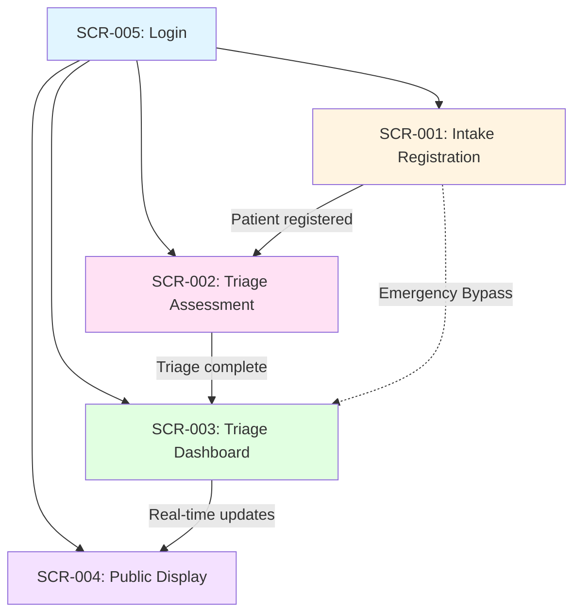

# Screen Inventory & Layout Specifications

**Created**: 2026-02-17
**Application**: Ragus - ER Triage System
**Total Screens**: 5 (Phase 1 Foundation)

---

## 📱 Global Layout Structure

### Application Shell

```
┌─────────────────────────────────────────────────────────────┐
│                     HEADER (80px)                           │
│  [Ragus Logo] | [Current Queue Count] | [User: Name]        │
├─────────────────────────────────────────────────────────────┤
│                    MAIN CONTENT                             │
│                    (100% height - header)                   │
│                    Role-based single screen                 │
└─────────────────────────────────────────────────────────────┘
```

**Note**: No sidebar - each role sees dedicated full-screen interface. No navigation menu (staff assigned to single station).

### Responsive Breakpoints

| Breakpoint | Width | Layout | Target Device |
|------------|-------|--------|---------------|
| Desktop | >1280px | Full layout, multi-column | Workstation at intake/triage desk |
| Tablet | 768-1280px | Touch-optimized, single column | Touchscreen tablet at triage station |
| Mobile | <768px | Not supported | N/A - ER environment uses dedicated hardware |

**Design Priority**: Optimized for 1920x1080 desktop monitors and 10-12" touchscreen tablets.

---

## 📺 Screen Inventory

### 1. Intake Registration Screen (SCR-001)

**Path**: `/intake`
**Purpose**: Ultra-fast patient registration at ER entrance
**Primary User**: Intake Nurse (Jenny)
**Phase**: Phase 1 - Foundation
**Related Epics**: Epic 1.1 (Ultra-Fast Intake), Epic 1.2 (Glove-Friendly UI)

#### Layout Grid

```
┌─────────────────────────────────────────────────────────────┐
│ HEADER: Ragus | Queue: 12 Patients | User: Jenny M.         │
├─────────────────────────────────────────────────────────────┤
│                                                              │
│  ┌────────────────────────────────────────────────────────┐ │
│  │ INTAKE FORM (centered, 800px max-width)                │ │
│  │                                                         │ │
│  │  [Label: Full Name *]                                  │ │
│  │  ┌───────────────────────────────────────────────────┐ │ │
│  │  │ [Large text input - 80px height]                  │ │ │
│  │  └───────────────────────────────────────────────────┘ │ │
│  │                                                         │ │
│  │  [Label: Date of Birth *]                             │ │
│  │  ┌───────────────────────────────────────────────────┐ │ │
│  │  │ [Large date picker - 80px height]                 │ │ │
│  │  └───────────────────────────────────────────────────┘ │ │
│  │                                                         │ │
│  │  [Label: Chief Complaint *]                           │ │
│  │  ┌───────────────────────────────────────────────────┐ │ │
│  │  │ [Large text input - 80px height]                  │ │ │
│  │  └───────────────────────────────────────────────────┘ │ │
│  │                                                         │ │
│  │  ┌───────────────┐  ┌───────────────────────────────┐ │ │
│  │  │ [EMERGENCY    │  │ [SUBMIT INTAKE]               │ │ │
│  │  │  BYPASS]      │  │ (Primary - 80x200px)          │ │ │
│  │  │ (Red, 80x180) │  │                               │ │ │
│  │  └───────────────┘  └───────────────────────────────┘ │ │
│  └────────────────────────────────────────────────────────┘ │
│                                                              │
│  [Status bar: Last patient: "JM-17" registered at 14:32]    │
└─────────────────────────────────────────────────────────────┘
```

#### Components

| Component | Location | Description | Data Source | Size |
|-----------|----------|-------------|-------------|------|
| Full Name Input | Top | Text field for patient name | Patient entity | 80px height, 60px tap target |
| Date of Birth Picker | Middle | Date selection UI | Patient entity | 80px height, 60px tap target |
| Chief Complaint Input | Middle | Short text description | Patient entity | 80px height, 60px tap target |
| Emergency Bypass Button | Bottom left | Red alert button for trauma | N/A - state trigger | 80x180px |
| Submit Intake Button | Bottom right | Primary action | N/A - form submit | 80x200px |
| Status Bar | Bottom | Last action feedback | Real-time state | Full width |

#### States

| State | Trigger | Display | Notes |
|-------|---------|---------|-------|
| Default | Page load | Empty form, enabled Submit | Tab navigation enabled |
| Filling | User typing | Real-time validation | Keyboard shortcuts active (Ctrl+S = submit) |
| Emergency Bypass | Red button click | Skip DOB, submit with Name + Complaint only | <5 second intake for trauma |
| Submitting | Submit click | Disabled form, spinner | ~200ms average |
| Success | Submit complete | Green toast + clear form | Patient ID shown (e.g., "JM-17") |
| Error | Network failure | Red toast + retry | Form data preserved |
| LWBS Mode | Keyboard shortcut (Ctrl+L) | One-click "Left Without Being Seen" | Patient marked as LWBS in queue |

#### JTBD Mapping

| JTBD ID | Capability Provided |
|---------|---------------------|
| JTBD-1.1 | Ultra-fast intake (<30 seconds) via minimal form |
| JTBD-1.2 | Glove-friendly UI with 60x60px minimum touch targets |
| JTBD-1.3 | Keyboard navigation (Tab-Enter flow) |
| JTBD-1.4 | Emergency Bypass for trauma cases |
| JTBD-1.5 | LWBS one-click marking (Ctrl+L shortcut) |

#### Feature Coverage

| Feature ID | Implementation |
|------------|----------------|
| US-1.1.1 | Minimal 3-field form (Name, DOB, Complaint) |
| US-1.1.2 | Tab-Enter navigation flow |
| US-1.1.3 | Emergency Bypass button (red, prominent) |
| US-1.1.4 | Keyboard shortcuts (Ctrl+S submit, Ctrl+L LWBS) |
| US-1.1.5 | LWBS one-click marking |
| US-1.2.1 | 60x60px minimum touch targets |

---

### 2. Triage Assessment Screen (SCR-002)

**Path**: `/triage`
**Purpose**: Capture vitals and ESI level assignment
**Primary User**: Triage Nurse (Michael)
**Phase**: Phase 1 - Foundation
**Related Epics**: Epic 1.2 (Glove-Friendly UI), Epic 1.4 (Manual-Control Triage), Epic 1.6 (Zero-Training Usability)

#### Layout Grid

```
┌─────────────────────────────────────────────────────────────┐
│ HEADER: Ragus | Queue: 12 | Next: "LC-17" | User: Michael K.│
├─────────────────────────────────────────────────────────────┤
│                                                              │
│  ┌────────────────────────────────────────────────────────┐ │
│  │ PATIENT INFO (top bar - read-only)                     │ │
│  │ ID: LC-17 | Name: Linda C. | DOB: 1965-03-12           │ │
│  │ Complaint: Chest pain, shortness of breath             │ │
│  └────────────────────────────────────────────────────────┘ │
│                                                              │
│  ┌───────────────────────────┐  ┌──────────────────────────┐│
│  │ VITALS (left, 400px)      │  │ ESI LEVEL (right, 400px) ││
│  │                           │  │                          ││
│  │ [BP] ┌─────────────────┐ │  │ ┌────────────────────┐  ││
│  │      │ [120] / [80]    │ │  │ │ [1 - Immediate]    │  ││
│  │      │ (80px height)   │ │  │ │ (Red, 100x300px)   │  ││
│  │      └─────────────────┘ │  │ └────────────────────┘  ││
│  │                           │  │ ┌────────────────────┐  ││
│  │ [HR] ┌─────────────────┐ │  │ │ [2 - Emergent]     │  ││
│  │      │ [72]            │ │  │ │ (Orange, 100x300)  │  ││
│  │      │ (80px height)   │ │  │ └────────────────────┘  ││
│  │      └─────────────────┘ │  │ ┌────────────────────┐  ││
│  │                           │  │ │ [3 - Urgent]       │  ││
│  │ [O2] ┌─────────────────┐ │  │ │ (Yellow, 100x300)  │  ││
│  │      │ [98]            │ │  │ └────────────────────┘  ││
│  │      │ (80px height)   │ │  │ ┌────────────────────┐  ││
│  │      └─────────────────┘ │  │ │ [4 - Less Urgent]  │  ││
│  │                           │  │ │ (Green, 100x300)   │  ││
│  │ [Temp]┌─────────────────┐│  │ └────────────────────┘  ││
│  │      │ [37.2]          │ │  │ ┌────────────────────┐  ││
│  │      │ (80px height)   │ │  │ │ [5 - Non-Urgent]   │  ││
│  │      └─────────────────┘ │  │ │ (Blue, 100x300)    │  ││
│  └───────────────────────────┘  └──────────────────────────┘│
│                                                              │
│  ┌────────────────────────────────────────────────────────┐ │
│  │ [SUBMIT TRIAGE & LOAD NEXT]  (Primary, 80x full-width)│ │
│  └────────────────────────────────────────────────────────┘ │
└─────────────────────────────────────────────────────────────┘
```

#### Components

| Component | Location | Description | Data Source | Size |
|-----------|----------|-------------|-------------|------|
| Patient Info Bar | Top | Read-only patient context | Patient entity | Full width, 60px |
| BP Input (Systolic/Diastolic) | Left panel | Dual numeric input | Vitals entity | 80px height each |
| HR Input | Left panel | Numeric input | Vitals entity | 80px height |
| O2 Saturation Input | Left panel | Numeric input | Vitals entity | 80px height |
| Temperature Input | Left panel | Numeric input | Vitals entity | 80px height |
| ESI Level Buttons (5) | Right panel | Color-coded priority buttons | Patient entity (ESI field) | 100x300px each |
| Submit & Next Button | Bottom | Auto-advance to next patient | Queue state | 80px height, full width |

#### States

| State | Trigger | Display | Notes |
|-------|---------|---------|-------|
| Loading | Screen init | Patient info + empty vitals | Next patient loaded from queue |
| Filling Vitals | User input | Real-time validation | Numeric keyboards on touch |
| ESI Selected | ESI button click | Highlighted button | Color-coded visual feedback |
| Complete | All vitals + ESI | Enabled submit button | <60 second target |
| Submitting | Submit click | Disabled form, spinner | WebSocket update to triage board |
| Auto-Advance | Submit complete | Next patient loads automatically | Zero-click workflow |
| Queue Empty | No patients | "No patients in queue" message | Idle state |

#### JTBD Mapping

| JTBD ID | Capability Provided |
|---------|---------------------|
| JTBD-2.1 | Auto-advance triage queue (next patient loads) |
| JTBD-2.2 | Large vitals entry fields (80px height) |
| JTBD-2.3 | ESI level assignment with color-coded buttons |
| JTBD-2.5 | Zero-training usability (intuitive workflow) |

#### Feature Coverage

| Feature ID | Implementation |
|------------|----------------|
| US-1.2.2 | Large vitals entry fields (80px height, 60px tap targets) |
| US-1.4.3 | Auto-advance triage queue |
| US-1.6.1 | Intuitive workflow (intake → triage → board) |
| US-1.6.3 | Color-coded ESI buttons (red, orange, yellow, green, blue) |
| US-1.6.4 | ESI level assignment UI |

---

### 3. Triage Dashboard (Kanban Board) (SCR-003)

**Path**: `/board`
**Purpose**: Manual control of patient flow across triage stages
**Primary User**: Triage Doctor (Sarah)
**Phase**: Phase 1 - Foundation
**Related Epics**: Epic 1.4 (Manual-Control Triage)

#### Layout Grid

```
┌────────────────────────────────────────────────────────────────────────────────┐
│ HEADER: Ragus | Total Patients: 12 | Avg Wait: 45 min | User: Dr. Sarah L.    │
├────────────────────────────────────────────────────────────────────────────────┤
│                                                                                 │
│ ┌──────┐ ┌──────┐ ┌──────┐ ┌──────┐ ┌──────┐ ┌──────────┐                    │
│ │To Be │ │ 30m  │ │ 60m  │ │ 120m │ │ Rest │ │ W/Doctor │                    │
│ │Triaged│ │ Wait │ │ Wait │ │ Wait │ │      │ │          │                    │
│ ├──────┤ ├──────┤ ├──────┤ ├──────┤ ├──────┤ ├──────────┤                    │
│ │      │ │      │ │      │ │      │ │      │ │          │                    │
│ │ ┌──┐ │ │ ┌──┐ │ │ ┌──┐ │ │ ┌──┐ │ │ ┌──┐ │ │  ┌──┐    │                    │
│ │ │LC│ │ │ │JM│ │ │ │SM│ │ │ │TK│ │ │ │RB│ │ │  │AP│    │                    │
│ │ │-17│ │ │ │-17│ │ │ │-16│ │ │ │-15│ │ │ │-17│ │ │-14│    │                    │
│ │ │ESI2│ │ │ │ESI3│ │ │ │ESI4│ │ │ │ESI4│ │ │ │ESI5│ │ │ESI1│    │                    │
│ │ └──┘ │ │ └──┘ │ │ └──┘ │ │ └──┘ │ │ └──┘ │ │  └──┘    │                    │
│ │      │ │      │ │      │ │      │ │      │ │          │                    │
│ │ [Drag│ │      │ │      │ │      │ │      │ │          │                    │
│ │ drop]│ │      │ │      │ │      │ │      │ │          │                    │
│ └──────┘ └──────┘ └──────┘ └──────┘ └──────┘ └──────────┘                    │
│                                                                                 │
│ [Quick Actions Bar]                                                            │
│ ┌──────────────┐ ┌──────────────┐ ┌──────────────┐                           │
│ │ Bulk Select  │ │ Move Selected│ │ Refresh All  │                           │
│ │ (Ctrl+Click) │ │ (to column)  │ │              │                           │
│ └──────────────┘ └──────────────┘ └──────────────┘                           │
└────────────────────────────────────────────────────────────────────────────────┘
```

#### Components

| Component | Location | Description | Data Source | Size |
|-----------|----------|-------------|-------------|------|
| Column Headers (6) | Top row | Stage labels | Hard-coded | Fixed width 200px each |
| Patient Cards | Columns | Draggable cards with ID, ESI | Patient entity + Triage state | 120x180px |
| Drag-and-Drop Zone | Full board | Interactive drop targets | State management | Full board |
| Quick Actions Bar | Bottom | Bulk operations | N/A | Full width, 60px |
| Bulk Select Mode | Cards | Multi-select via Ctrl+Click | Selection state | Visual checkbox overlay |
| Move Selected Dropdown | Bottom bar | Target column selector | Column list | Dropdown, 60px height |

#### States

| State | Trigger | Display | Notes |
|-------|---------|---------|-------|
| Default | Page load | All patients in columns | Real-time WebSocket sync |
| Dragging | Card drag start | Card follows cursor, drop zones highlight | Visual feedback |
| Dropping | Card drop | Card moves to column, board updates | <1 second update to public display |
| Bulk Select | Ctrl+Click cards | Checkboxes on selected cards | Multi-select enabled |
| Bulk Move | Move Selected click | All selected cards move to target column | Batch operation |
| Empty Column | No patients | "No patients" placeholder | Normal state |
| WebSocket Disconnected | Network failure | Red banner "Connection lost - updates paused" | Auto-reconnect |

#### JTBD Mapping

| JTBD ID | Capability Provided |
|---------|---------------------|
| JTBD-3.1 | One-click patient state changes (drag-and-drop) |
| JTBD-3.2 | Manual triage board control (Kanban) |
| JTBD-3.4 | Real-time updates (<1 second to public display) |
| JTBD-3.5 | Bulk patient updates (multi-select + move) |

#### Feature Coverage

| Feature ID | Implementation |
|------------|----------------|
| US-1.4.1 | Kanban board UI (6 columns) |
| US-1.4.2 | Drag-and-drop patient cards + one-click time slots |
| US-1.4.4 | Sub-1-second WebSocket updates |
| US-1.4.5 | Bulk patient update capability |

---

### 4. Public Display Screen (SCR-004)

**Path**: `/public-display`
**Purpose**: Privacy-compliant patient wait time display for waiting room
**Primary User**: Patient Advocate (Maria) + Patients/Families
**Phase**: Phase 1 - Foundation
**Related Epics**: Epic 1.3 (Privacy-First Public Display)

#### Layout Grid

```
┌────────────────────────────────────────────────────────────┐
│          EMERGENCY ROOM WAIT TIMES                         │
│          Ragus Hospital - [Current Date/Time]              │
├────────────────────────────────────────────────────────────┤
│                                                            │
│  ┌──────────────────────────────────────────────────────┐ │
│  │ Patient ID    │ Wait Category    │ Status            │ │
│  ├──────────────────────────────────────────────────────┤ │
│  │ JM-17         │ Short Wait       │ Being Triaged     │ │
│  │               │ (<30 minutes)    │                   │ │
│  ├──────────────────────────────────────────────────────┤ │
│  │ LC-17         │ Medium Wait      │ With Nurse        │ │
│  │               │ (30-60 minutes)  │                   │ │
│  ├──────────────────────────────────────────────────────┤ │
│  │ SM-16         │ Medium Wait      │ Waiting           │ │
│  │               │ (30-60 minutes)  │                   │ │
│  ├──────────────────────────────────────────────────────┤ │
│  │ TK-15         │ Long Wait        │ Waiting           │ │
│  │               │ (60-120 minutes) │                   │ │
│  ├──────────────────────────────────────────────────────┤ │
│  │ RB-17         │ Long Wait        │ Resting           │ │
│  │               │ (120+ minutes)   │                   │ │
│  └──────────────────────────────────────────────────────┘ │
│                                                            │
│  [Footer: Last updated 14:32 | For urgent needs, see      │
│   reception desk]                                          │
└────────────────────────────────────────────────────────────┘
```

#### Components

| Component | Location | Description | Data Source | Size |
|-----------|----------|-------------|-------------|------|
| Header | Top | ER name + timestamp | Static + real-time clock | Full width, 100px |
| Patient Table | Center | Patient ID, wait category, status | Triage board state | Auto-height, 3 columns |
| Patient ID Column | Left | Initials + day (e.g., "JM-17") | Patient.anonymousId | 30% width |
| Wait Category Column | Middle | Category text (Short/Medium/Long) | Calculated from entry time + ESI | 40% width |
| Status Column | Right | Current stage (Waiting, Triaged, etc.) | Triage board column | 30% width |
| Footer | Bottom | Last update timestamp + help text | Real-time | Full width, 60px |

#### States

| State | Trigger | Display | Notes |
|-------|---------|---------|-------|
| Default | Page load | Full patient list | Auto-refresh every 5 seconds |
| Real-Time Update | WebSocket event | Smooth row updates | <1 second latency from board changes |
| Empty Queue | No patients | "No patients currently waiting" | Normal state |
| Collision Detected | Duplicate ID | Append counter (e.g., "JM-17-2") | Automatic collision resolution |
| Dark Mode | Time-based (19:00-07:00) | Dark theme for night shifts | Auto-toggle based on system time |
| Connection Lost | Network failure | Yellow banner "Display updates paused" | Graceful degradation |

#### JTBD Mapping

| JTBD ID | Capability Provided |
|---------|---------------------|
| JTBD-4.1 | Anonymous patient IDs (initials + day) |
| JTBD-4.2 | Category-based wait times (no countdown timers) |
| JTBD-4.3 | GDPR/HIPAA compliant display |
| JTBD-4.5 | Family tracking via patient ID |

#### Feature Coverage

| Feature ID | Implementation |
|------------|----------------|
| US-1.3.1 | Initials+day patient ID generation |
| US-1.3.2 | Collision counter for duplicate IDs |
| US-1.3.3 | Category-based wait time display |
| US-1.3.4 | GDPR/HIPAA compliant (no full names) |
| US-1.3.5 | Family tracking via patient ID |

---

### 5. Login Screen (SCR-005)

**Path**: `/login`
**Purpose**: Role-based authentication for clinical staff
**Primary User**: All staff (Intake, Triage, Doctors)
**Phase**: Phase 1 - Foundation
**Related Epics**: Epic 1.6 (Zero-Training Usability)

#### Layout Grid

```
┌────────────────────────────────────────────────────────────┐
│                                                            │
│                                                            │
│                    [Ragus Logo]                            │
│              Emergency Room Triage System                  │
│                                                            │
│  ┌────────────────────────────────────────────────────────┐│
│  │                                                        ││
│  │  [Label: Username]                                     ││
│  │  ┌──────────────────────────────────────────────────┐ ││
│  │  │ [Text input - 60px height]                       │ ││
│  │  └──────────────────────────────────────────────────┘ ││
│  │                                                        ││
│  │  [Label: Password]                                     ││
│  │  ┌──────────────────────────────────────────────────┐ ││
│  │  │ [Password input - 60px height]                   │ ││
│  │  └──────────────────────────────────────────────────┘ ││
│  │                                                        ││
│  │  ┌──────────────────────────────────────────────────┐ ││
│  │  │ [LOGIN BUTTON]  (Primary, 60x full-width)       │ ││
│  │  └──────────────────────────────────────────────────┘ ││
│  │                                                        ││
│  └────────────────────────────────────────────────────────┘│
│                                                            │
│  [Footer: v1.0 | On-premise deployment | 99% LAN uptime]  │
└────────────────────────────────────────────────────────────┘
```

#### Components

| Component | Location | Description | Data Source | Size |
|-----------|----------|-------------|-------------|------|
| Ragus Logo | Top center | Application branding | Static asset | 200x60px |
| Username Input | Middle | Text field | User entity | 60px height |
| Password Input | Middle | Password field (masked) | User entity | 60px height |
| Login Button | Middle | Primary action | Authentication service | 60px height, full width |
| Version Footer | Bottom | System info | Static | Full width, 40px |

#### States

| State | Trigger | Display | Notes |
|-------|---------|---------|-------|
| Default | Page load | Empty form, enabled login | Focus on username field |
| Filling | User typing | Real-time validation | Enter key triggers login |
| Submitting | Login click | Disabled form, spinner | ~500ms average |
| Success | Valid credentials | Redirect to role-based screen | Role determined from user record |
| Error | Invalid credentials | Red toast "Invalid username/password" | Form reset, focus on username |
| Offline Mode | No network | Yellow banner "System offline - check network" | LAN-only operation |

#### JTBD Mapping

| JTBD ID | Capability Provided |
|---------|---------------------|
| JTBD-5.4 | Role-based authentication (staff login) |

#### Feature Coverage

| Feature ID | Implementation |
|------------|----------------|
| US-1.6.1 | Intuitive login workflow |
| US-1.6.3 | Clear visual hierarchy (large labels, buttons) |

---

## 🔗 Screen Flow Diagram



---

## 📊 Screen Complexity Analysis

| Screen | Feature Count | Complexity | Split Decision |
|--------|---------------|------------|----------------|
| SCR-001: Intake | 6 features | Simple | Keep as single screen - minimal workflow |
| SCR-002: Triage | 5 features | Simple | Keep as single screen - focused task |
| SCR-003: Board | 4 features | Medium | Keep as single screen - cohesive Kanban |
| SCR-004: Display | 5 features | Simple | Keep as single screen - read-only |
| SCR-005: Login | 1 feature | Simple | Keep as single screen - authentication |

**Total Features**: 21 features mapped to 5 screens
**Average Complexity**: Simple to Medium (no screen exceeds 10 features)

---

## 🎯 Coverage Summary

### Phase 1 Epics Coverage

| Epic | Screens | Coverage |
|------|---------|----------|
| Epic 1.1: Ultra-Fast Intake | SCR-001 | 100% (5/5 features) |
| Epic 1.2: Glove-Friendly UI | SCR-001, SCR-002 | 100% (4/4 features) |
| Epic 1.3: Privacy-First Display | SCR-004 | 100% (5/5 features) |
| Epic 1.4: Manual-Control Triage | SCR-003 | 100% (4/4 features) |
| Epic 1.5: Offline-First Architecture | Infrastructure (not screen-based) | N/A |
| Epic 1.6: Zero-Training Usability | SCR-001, SCR-002, SCR-005 | 100% (4/4 features) |

### JTBD Coverage

**Total JTBDs Addressed**: 18 (from JTBD-1.1 to JTBD-5.4)
**Screen-Specific JTBDs**: 15
**Infrastructure JTBDs**: 3 (JTBD-5.1, JTBD-5.2, JTBD-5.3)

---

## 📐 Design Principles Applied

1. **Glove-Friendly UI**: Minimum 60x60px touch targets on all interactive elements
2. **Zero-Training**: Intuitive workflows with clear visual hierarchy
3. **Speed-First**: Ultra-fast forms (<30 second intake, <60 second triage)
4. **Privacy-First**: Anonymous patient IDs on public display
5. **Manual Control**: No automation - doctors control all patient flow
6. **Offline-First**: LAN-based operation, no cloud dependencies

---

**Generated by**: Discovery_SpecScreens v4.0.0
**Smart Obsolescence Handling**: Enabled
**Project Classification**: FULL_STACK
